# 📊 Phase 6 — 30 Chart Practice Questions

**Every question is a picture.** Look at the chart, then write the matplotlib or seaborn code that produces it. The data is given to you, so any difference you see is your chart code and not your numbers.

This is the companion to [Module 27: Data Visualization](module-27-data-visualization.md). That module shows you the syntax; this file finds out whether you can produce it from a blank file, which is a different skill and the one you are actually short of.

Solutions are in a **separate file** — [chart-practice-solutions.md](chart-practice-solutions.md) — on purpose. Having them one scroll away is the difference between practice and reading.

---

## Before you start

Assume this prelude in every answer. Do not import anything else unless the question shows an import:

```python
import matplotlib.pyplot as plt
import numpy as np
import pandas as pd
import seaborn as sns
```

Build every figure with `fig, ax = plt.subplots(...)` rather than the bare `plt.` calls. The module shows both; the object API is the one that survives contact with subplots, twin axes and seaborn.

**Tier 6 needs the starter project's cleaned data:**

```bash
cd starter-project
python data/make_messy_data.py
python src/clean.py            # writes data/merged_clean.csv
```

| Tier | Questions | Focus                                     |
| ---- | --------- | ----------------------------------------- |
| 1    | Q1–Q5     | One series, one axes                      |
| 2    | Q6–Q11    | Several series on one chart               |
| 3    | Q12–Q16   | Distributions                             |
| 4    | Q17–Q21   | Relationships and matrices                |
| 5    | Q22–Q26   | Composition and annotation                |
| 6    | Q27–Q30   | Report charts from the messy starter data |

> 💡 **Tip:** Spend a full minute looking at the image before you type. Count the bars. Read the axis labels out loud. Note what is sorted, what is annotated, what is grey and what is coloured. Most failures on these questions are observation failures, not coding failures.

---

## Tier 1 — One series, one axes (Q1–Q5)

Nothing layered, nothing grouped. The whole task is noticing that a title, an x label and a y label are three separate method calls, and that sorting happens before plotting.

## 📋 Assignment 1 — Line chart

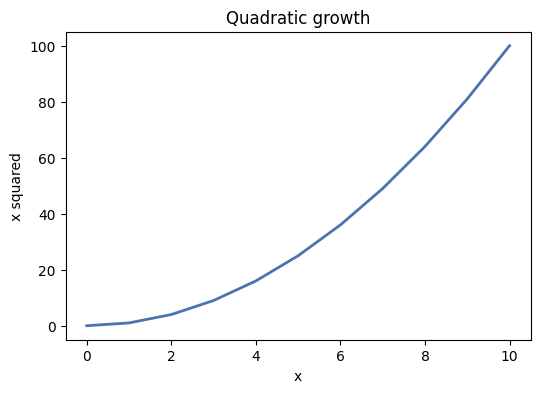

A single blue line showing y = x squared from 0 to 10, with both axes labelled and a title.

**Data:**

```python
x = np.arange(0, 11)
y = x ** 2
```

**Your chart must have:**

- one line, no markers
- x label, y label and a title

**Expected:** title `Quadratic growth` · xlabel `x` · ylabel `x squared`. The curve passes through (10, 100).

> ⚠️ **Self-check:** Your y axis must reach **100**. If it stops at 10 you plotted `x`, not `x ** 2`.

**Explanation:** `ax.plot(x, y)` draws the line; the three label calls are separate methods because Matplotlib treats every piece of text as its own artist. A chart with no axis labels is unreadable to anyone but its author.

---

## 📋 Assignment 2 — Bar chart, sorted, with value labels

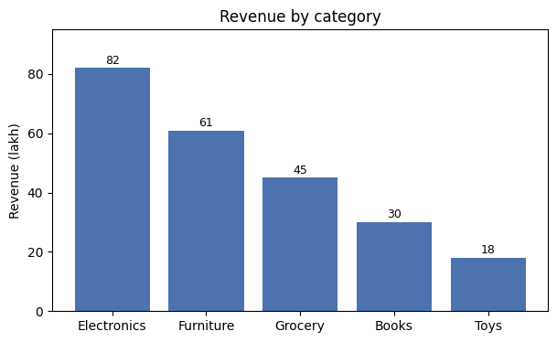

Five categories as vertical bars, tallest on the left, with the value printed above each bar.

**Data:**

```python
labels = ["Electronics", "Furniture", "Grocery", "Books", "Toys"]
values = [82, 61, 45, 30, 18]
```

**Your chart must have:**

- 5 bars, descending left to right
- a text label above every bar
- y limit leaving room for the top label

**Expected:** title `Revenue by category` · ylabel `Revenue (lakh)`. Bar heights **82, 61, 45, 30, 18**.

> ⚠️ **Self-check:** Sort the values **and the labels together**. `values.sort()` on its own leaves every label attached to the wrong bar, raises nothing, and produces a chart that looks completely professional.

**Explanation:** Sorting must happen **before** plotting, and the labels must travel with the values. `ax.text` places each number at `(bar_index, height + padding)` — the padding is why `set_ylim` needs headroom, or the top label is clipped.

---

## 📋 Assignment 3 — Horizontal bar chart

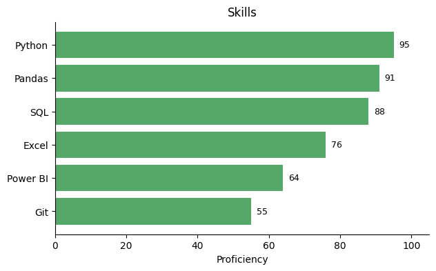

Six skills as horizontal bars with the longest at the top, values printed to the right of each bar, and no top or right spine.

**Data:**

```python
labels = ["Python", "SQL", "Excel", "Power BI", "Pandas", "Git"]
values = [95, 88, 76, 64, 91, 55]
```

**Your chart must have:**

- 6 horizontal bars, longest at the top
- value labels to the right
- top and right spines removed

**Expected:** title `Skills` · xlabel `Proficiency`. Python (95) at the top, Git (55) at the bottom.

> ⚠️ **Self-check:** `barh` draws the **first** item at the **bottom**, so you sort **ascending** to get the largest at the top. Sorting descending — which is correct for `ax.bar` — silently flips the whole chart.

**Explanation:** `barh` draws the first item at the **bottom**, so the sort direction is the opposite of `bar`. Removing the top and right spines is pure noise reduction — they enclose the data without encoding anything.

---

## 📋 Assignment 4 — Histogram

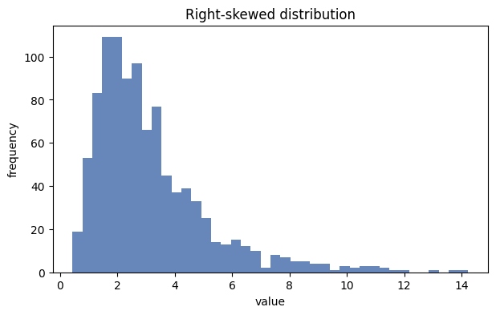

A histogram of 1,000 right-skewed values in 40 bins.

**Data:**

```python
rng = np.random.RandomState(0)
data = rng.lognormal(mean=1.0, sigma=0.6, size=1000)
```

**Your chart must have:**

- exactly 40 bins
- x and y labels naming what is counted

**Expected:** title `Right-skewed distribution` · xlabel `value` · ylabel `frequency`. A long tail to the right, peak near 2.5.

> ⚠️ **Self-check:** Count the bars: **40**. The default is 10, and a histogram with the default bin count will hide the shape you are trying to show.

**Explanation:** The bin count is the only real decision in a histogram. Matplotlib's default of 10 is almost always too coarse: it can hide a second peak entirely, which is the one thing a histogram exists to reveal.

---

## 📋 Assignment 5 — Donut chart

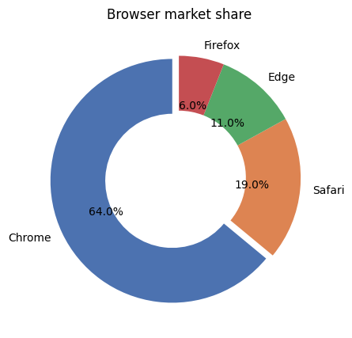

Browser market share as a donut — a pie with a hole — each slice labelled with its percentage and the largest slice pulled out.

**Data:**

```python
labels = ["Chrome", "Safari", "Edge", "Firefox"]
values = [64, 19, 11, 6]
```

**Your chart must have:**

- 4 slices with a hole in the middle
- a percentage inside each slice
- the Chrome slice offset from the centre

**Expected:** title `Browser market share`. Percentages **64.0%, 19.0%, 11.0%, 6.0%**, summing to 100.

> ⚠️ **Self-check:** The percentages must sum to **100.0**. If you see the raw numbers 64, 19, 11, 6 instead, your `autopct` format string is printing the value rather than the share.

**Explanation:** `wedgeprops=dict(width=0.45)` cuts the hole; `autopct` formats the percentage Matplotlib computes for you. Donuts are readable at four slices and become useless past six — angle is a much harder visual comparison than length, which is why bars usually win.

---

## Tier 2 — Several series on one chart (Q6–Q11)

Two or more things to compare. Every one of these fails in the same way: the drawing works, the positioning or the scale is wrong, and nothing raises.

## 📋 Assignment 6 — Grouped bar chart

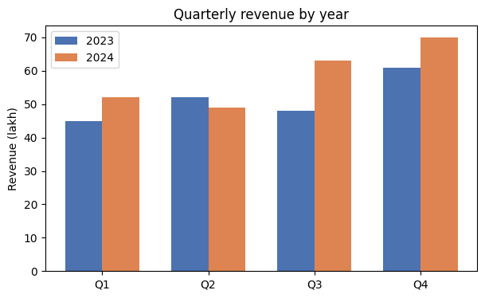

Four quarters on the x axis with two series, 2023 and 2024, drawn side by side rather than on top of each other.

**Data:**

```python
labels = ["Q1", "Q2", "Q3", "Q4"]
y2023 = [45, 52, 48, 61]
y2024 = [52, 49, 63, 70]
```

**Your chart must have:**

- 8 bars in 4 clearly separated pairs
- a legend naming the two years
- quarter names centred under each pair

**Expected:** title `Quarterly revenue by year` · ylabel `Revenue (lakh)`. Q3 shows the largest year-on-year jump, 48 → 63.

> ⚠️ **Self-check:** If the bars overlap, your width and your offset disagree — the offset must be exactly `width / 2`. If the x labels vanish, you set the ticks but not the tick labels.

**Explanation:** Matplotlib will not group bars for you. You compute the positions yourself: `x - w/2` and `x + w/2` around each tick. That is also why the tick labels need setting explicitly — the bars sit at numeric positions, not at category names.

---

## 📋 Assignment 7 — Stacked bar chart

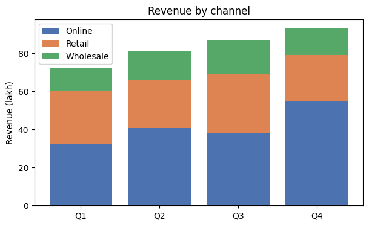

The same four quarters, but each bar split into three stacked segments: Online, Retail and Wholesale.

**Data:**

```python
q = ["Q1", "Q2", "Q3", "Q4"]
online    = np.array([32, 41, 38, 55])
retail    = np.array([28, 25, 31, 24])
wholesale = np.array([12, 15, 18, 14])
```

**Your chart must have:**

- 4 bars of 3 segments each, 12 rectangles in total
- segments stacked, never overlapping
- a legend naming the channels

**Expected:** title `Revenue by channel` · ylabel `Revenue (lakh)`. The Q4 bar is the tallest at **93** (55 + 24 + 14).

> ⚠️ **Self-check:** Every layer above the first needs `bottom=`. Miss one and that segment starts from zero, hiding the layer underneath it. Also note the data is given as **numpy arrays** — with plain lists, `online + retail` concatenates into 8 elements instead of adding.

**Explanation:** `bottom=` tells each layer where to start. Stacked bars are good for showing a total split into parts, but bad for comparing the middle segments across bars — only the bottom layer shares a common baseline.

---

## 📋 Assignment 8 — Count plot split by a second variable

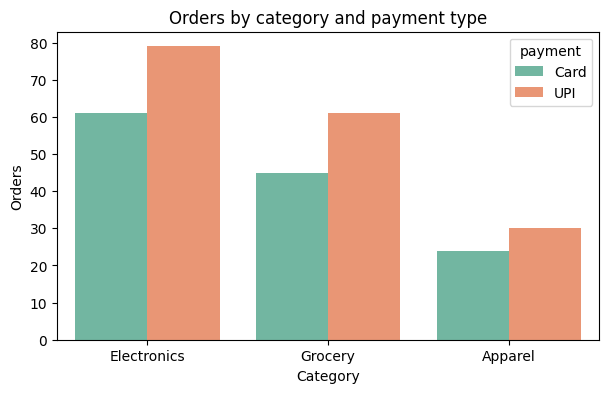

Order counts for three product categories, each split into two payment types drawn side by side.

**Data:**

```python
rng = np.random.RandomState(2)
df = pd.DataFrame({
    "category": rng.choice(["Electronics", "Grocery", "Apparel"], 300,
                           p=[0.45, 0.35, 0.20]),
    "payment": rng.choice(["Card", "UPI"], 300, p=[0.4, 0.6]),
})
```

**Your chart must have:**

- 6 bars in 3 pairs
- a legend titled with the splitting column

**Expected:** title `Orders by category and payment type` · xlabel `Category` · ylabel `Orders`. Bar heights **61 and 79** (Electronics), **45 and 61** (Grocery), **24 and 30** (Apparel).

> ⚠️ **Self-check:** If every bar has height 1 you aggregated first. `countplot` counts the rows itself — hand it the raw frame, not a `value_counts()`.

**Explanation:** `countplot` aggregates internally, which is what separates it from `barplot`. `hue=` splits each category into side-by-side bars and builds the legend from the column name automatically.

---

## 📋 Assignment 9 — Dual axis

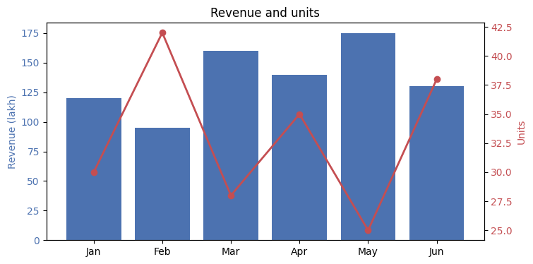

Revenue as bars against the left axis and units as a line against the right axis, with each y label coloured to match its series.

**Data:**

```python
months = ["Jan", "Feb", "Mar", "Apr", "May", "Jun"]
revenue = [120, 95, 160, 140, 175, 130]
units = [30, 42, 28, 35, 25, 38]
```

**Your chart must have:**

- 6 bars and 1 line
- two y axes with different scales
- both y labels and both sets of tick labels coloured

**Expected:** title `Revenue and units` · left ylabel `Revenue (lakh)` · right ylabel `Units`. The line peaks in Feb, the bars peak in May — the two series move in opposite directions, which is the whole point.

> ⚠️ **Self-check:** If the line lies flat along the bottom you plotted units on the **left** axis, where the revenue scale (0–175) crushes a 25–42 series into nothing. It renders perfectly and says nothing.

**Explanation:** Two different units cannot share one axis honestly. `twinx()` gives each its own scale — but the reader now has to work out which line belongs to which axis, which is why colour-coding the labels is not decoration but a requirement.

---

## 📋 Assignment 10 — One highlighted bar

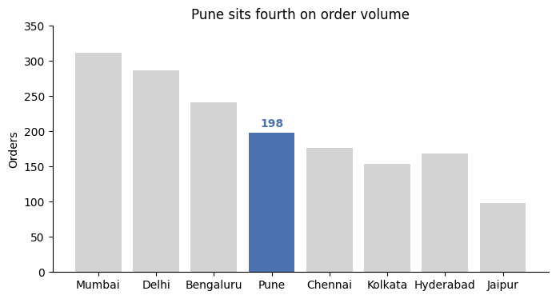

Eight cities as bars, every one light grey except the single bar the chart is about, which is dark blue and the only one labelled.

**Data:**

```python
labels = ["Mumbai", "Delhi", "Bengaluru", "Pune", "Chennai",
          "Kolkata", "Hyderabad", "Jaipur"]
values = [312, 287, 241, 198, 176, 154, 168, 98]
focus = "Pune"
```

**Your chart must have:**

- 8 bars in the original order, not sorted
- exactly one coloured bar and seven grey ones
- exactly one text label
- a title that states the finding

**Expected:** title `Pune sits fourth on order volume` · ylabel `Orders`. One text label reading **198**.

> ⚠️ **Self-check:** Exactly **one** dark bar and **one** label. Label all eight and the chart stops making a point. Note the title is a sentence, not `Orders by city` — that is the difference between a chart and a finding.

**Explanation:** Grey everything except the one thing you are talking about. This single technique does more for chart clarity than any styling library, and the title carries the finding rather than naming the axes.

---

## 📋 Assignment 11 — Lollipop chart

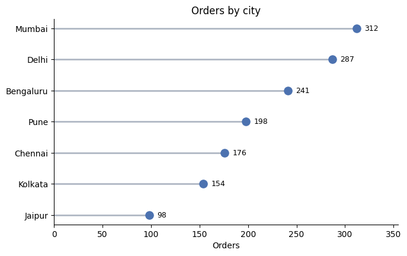

Seven cities as thin horizontal stems ending in a filled circle, largest at the top, each labelled with its value.

**Data:**

```python
labels = ["Mumbai", "Delhi", "Bengaluru", "Pune", "Chennai", "Kolkata", "Jaipur"]
values = [312, 287, 241, 198, 176, 154, 98]
```

**Your chart must have:**

- 7 stems, each ending in a dot
- no bar rectangles at all
- Mumbai at the top, Jaipur at the bottom
- value labels beside each dot

**Expected:** title `Orders by city` · xlabel `Orders`. Mumbai **312** at the top, Jaipur **98** at the bottom.

> ⚠️ **Self-check:** Each dot must sit exactly at the end of its stem. If the dots drift off, `scatter` received its arguments as `(y, x)` — the stem call takes `y` first and the scatter call takes `x` first, which is easy to get backwards.

**Explanation:** A lollipop encodes exactly the same information as a bar with a fraction of the ink. `hlines` draws the stems and `scatter` the heads — there is no built-in lollipop function, which is true of most "exotic" charts.

---

## Tier 3 — Distributions (Q12–Q16)

Charts that show a **shape** rather than a value. This is where the difference between summarising data and hiding data starts to matter.

## 📋 Assignment 12 — Histogram with mean and median lines

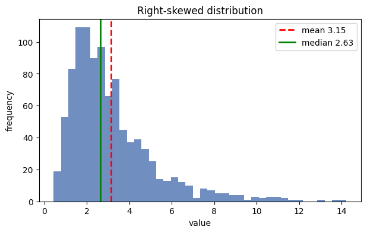

The same right-skewed histogram, now with a red dashed line at the mean, a green solid line at the median, and a legend giving both values.

**Data:**

```python
rng = np.random.RandomState(0)
data = rng.lognormal(mean=1.0, sigma=0.6, size=1000)
```

**Your chart must have:**

- 40 bins
- 2 vertical reference lines
- a legend showing both values to 2 decimals

**Expected:** Legend reads **mean 3.15** and **median 2.63**. The mean line sits to the right of the median line.

> ⚠️ **Self-check:** On right-skewed data the mean is always dragged **right** of the median by the tail. If yours are the other way round you swapped them — and that ordering is exactly the point the chart exists to make. Same reasoning as the outlier discussion in Module 26.

**Explanation:** On right-skewed data the mean always sits to the **right** of the median, dragged out by the tail. Drawing both makes the skew visible instantly and shows why the median is the honest summary — the same argument as Phase 6 Q44.

---

## 📋 Assignment 13 — Box plot with the points overlaid

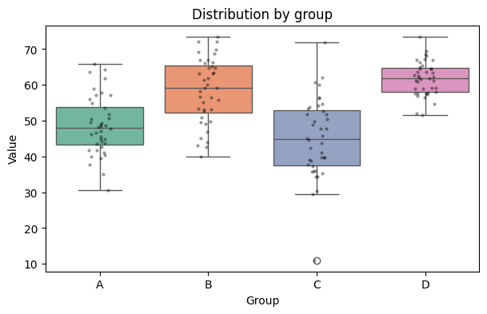

Four groups compared with box plots, with every individual observation drawn on top as a small semi-transparent black dot.

**Data:**

```python
rng = np.random.RandomState(3)
df = pd.DataFrame({
    "group": np.repeat(["A", "B", "C", "D"], 40),
    "value": np.concatenate([rng.normal(m, s, 40) for m, s in
                             [(50, 8), (58, 8), (46, 12), (62, 6)]]),
})
```

**Your chart must have:**

- 4 boxes with whiskers
- 160 individual points drawn over them
- both seaborn calls on the same axes

**Expected:** title `Distribution by group` · xlabel `Group` · ylabel `Value`. Group C is visibly the widest, group D the narrowest.

> ⚠️ **Self-check:** The dots must land **inside** the boxes. If you end up with two figures — one empty, one with the points — you forgot `ax=ax` on one of the two seaborn calls. Seaborn silently creates its own figure when you do not give it one.

**Explanation:** The box shows quartiles; the overlaid points show the actual sample. Adding the points guards against the box plot's biggest weakness: it looks identical whether a group has 8 observations or 800.

---

## 📋 Assignment 14 — Violin plot

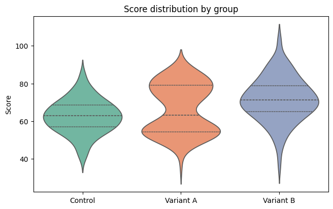

Three experiment groups compared with violins, showing the full shape of each distribution, with dashed quartile lines inside.

**Data:**

```python
rng = np.random.RandomState(6)
df = pd.DataFrame({
    "group": np.repeat(["Control", "Variant A", "Variant B"], 120),
    "score": np.concatenate([
        rng.normal(62, 9, 120),
        np.concatenate([rng.normal(55, 5, 60), rng.normal(78, 5, 60)]),
        rng.normal(70, 12, 120),
    ]),
})
```

**Your chart must have:**

- 3 violins
- dashed quartile lines inside each one
- no x axis label

**Expected:** title `Score distribution by group` · ylabel `Score` · xlabel empty. **Variant A is clearly two-humped.**

> ⚠️ **Self-check:** Variant A must show **two bulges**. If it looks like one fat blob you drew a boxplot instead — and that is precisely the finding a boxplot hides. Variant A's median sits between two groups of users and describes neither of them.

**Explanation:** A violin shows the full **shape** of the distribution. The bimodal group here is completely invisible in a box plot — its median falls between two clusters and describes neither of them.

---

## 📋 Assignment 15 — Bar chart with error bars

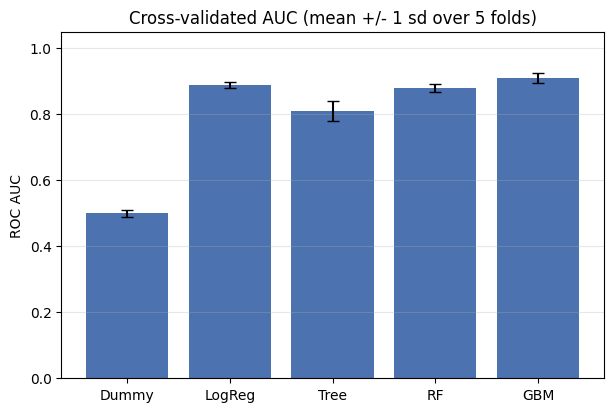

Five model scores as bars, each carrying a black vertical error bar with caps showing the standard deviation across folds.

**Data:**

```python
models = ["Dummy", "LogReg", "Tree", "RF", "GBM"]
means  = [0.50, 0.89, 0.81, 0.88, 0.91]
sds    = [0.01, 0.009, 0.031, 0.012, 0.014]
```

**Your chart must have:**

- 5 bars
- an error bar with visible caps on each
- horizontal gridlines only
- y axis running 0 to about 1.05

**Expected:** title `Cross-validated AUC (mean +/- 1 sd over 5 folds)` · ylabel `ROC AUC`. GBM (0.91) and LogReg (0.89) overlap within their error bars — the chart does not let you claim GBM won.

> ⚠️ **Self-check:** If the caps are invisible, check `capsize` — it defaults to 0. A bar chart of means with no error bars is a lie of omission, and it is the single most common chart in bad model reports.

**Explanation:** Error bars turn a point estimate into a range. Two bars whose error bars overlap are not distinguishable, and a bar chart of means without them invites a conclusion the data does not support.

---

## 📋 Assignment 16 — Line with a shaded uncertainty band

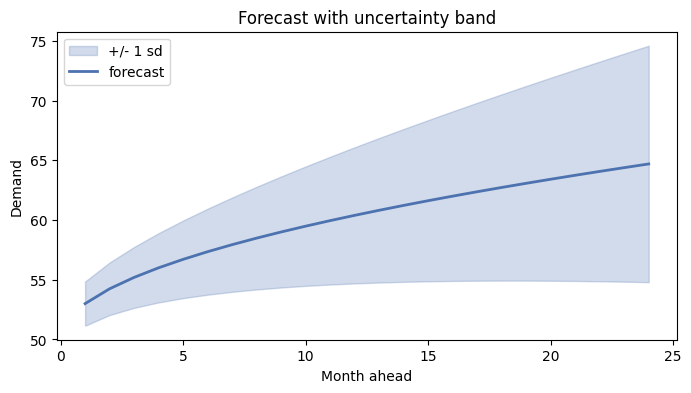

A forecast line with a shaded band around it showing plus or minus one standard deviation, widening as the forecast goes further out.

**Data:**

```python
x = np.arange(1, 25)
mean = 50 + 3 * np.sqrt(x)
sd = 1.5 + 0.35 * x
```

**Your chart must have:**

- one line with a transparent band around it
- the band narrow on the left and wide on the right
- both the line and the band in the legend

**Expected:** title `Forecast with uncertainty band` · xlabel `Month ahead` · ylabel `Demand`. The band spans roughly ±1.85 at month 1 and ±9.9 at month 24.

> ⚠️ **Self-check:** Draw the band **before** the line, or the fill covers it. And if your band is a constant width you passed a single number where the per-point `sd` array was needed — which quietly claims your 24-month forecast is as certain as your 1-month one.

**Explanation:** `fill_between` takes a lower and an upper array, so the band can widen with uncertainty. Drawing it **before** the line keeps the line visible on top — artists are drawn in call order.

---

## Tier 4 — Relationships and matrices (Q17–Q21)

Two variables at once, sometimes three. Colour stops being decoration and starts carrying information, which means it now needs a legend or a colourbar.

## 📋 Assignment 17 — Scatter plot coloured by a third variable

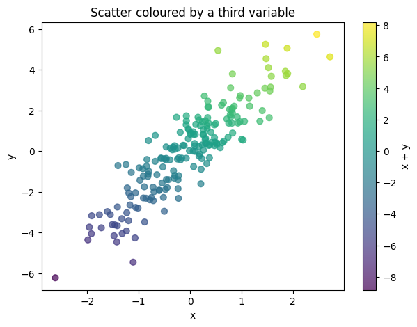

200 points positioned by x and y, coloured by a third variable using the viridis colormap, with a colourbar on the right.

**Data:**

```python
rng = np.random.RandomState(42)
x = rng.randn(200)
y = 2 * x + rng.randn(200)
z = x + y
```

**Your chart must have:**

- 200 semi-transparent points
- a colourbar labelled `x + y`
- colour varying along the trend, not randomly

**Expected:** title `Scatter coloured by a third variable` · xlabel `x` · ylabel `y` · colourbar label `x + y`. Two axes objects exist in the figure: the plot and the colourbar.

> ⚠️ **Self-check:** `fig.colorbar` needs the object **returned by** `ax.scatter`, not the data. Passing `z` raises; passing nothing at all leaves a chart where colour means something and nothing says what.

**Explanation:** `c=` plus `cmap=` encodes a third variable in colour, which is why a colourbar becomes mandatory: without it the colours carry information nobody can decode.

---

## 📋 Assignment 18 — Scatter with a fitted trend line

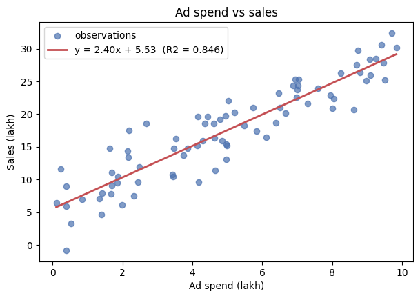

80 observations with a straight best-fit line through them, and the fitted equation with its R squared printed in the legend.

**Data:**

```python
rng = np.random.RandomState(9)
x = rng.uniform(0, 10, 80)
y = 2.4 * x + 5 + rng.randn(80) * 3
```

**Your chart must have:**

- 80 points and 1 straight line
- the fitted slope, intercept and R squared in the legend
- the line spanning the full x range

**Expected:** The legend reads **y = 2.40x + 5.53 (R2 = 0.846)**. Note the slope is not exactly the 2.4 the data was built from — 80 noisy points do not recover the truth precisely, and pretending otherwise is how people over-claim.

> ⚠️ **Self-check:** `np.polyfit(x, y, 1)` returns **slope first, intercept second**. Swap them and you get a line with the right numbers in the wrong places. A slope near 0.4 instead of 2.4 means you passed `y` and `x` the wrong way round and fitted x on y.

**Explanation:** `np.polyfit(x, y, 1)` returns **slope first, intercept second**. Putting the fitted equation and R² in the legend means the reader can judge the fit rather than trusting the line.

---

## 📋 Assignment 19 — Correlation heatmap

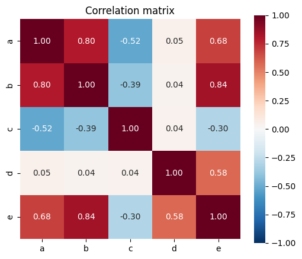

A correlation matrix of five variables as an annotated heatmap, coloured red to blue, centred on zero, values to two decimals.

**Data:**

```python
rng = np.random.RandomState(5)
n = 200
a = rng.randn(n)
b = a * 0.8 + rng.randn(n) * 0.6
c = -a * 0.5 + rng.randn(n) * 0.8
d = rng.randn(n)
e = b * 0.6 + d * 0.4
df = pd.DataFrame({"a": a, "b": b, "c": c, "d": d, "e": e})
```

**Your chart must have:**

- a 5x5 grid of 25 annotated cells
- square cells
- a diverging colour scale centred on zero, running -1 to 1

**Expected:** title `Correlation matrix`. The diagonal is all **1.00** and the deepest red. `a` and `b` correlate **+0.80**, `a` and `c` **-0.52**, and they are opposite colours.

> ⚠️ **Self-check:** Without `center=0` the colours lie about the sign — a correlation of -0.52 can end up the same shade as +0.2 just because of where the data happens to sit. Set `center=0`, `vmin=-1` and `vmax=1` so the scale is fixed and honest regardless of what the data happens to contain.

**Explanation:** `center=0` on a diverging colormap is what makes the sign readable. Without it the colour scale stretches to fit the data and −0.5 can end up looking like a mild positive.

---

## 📋 Assignment 20 — Pivot table heatmap

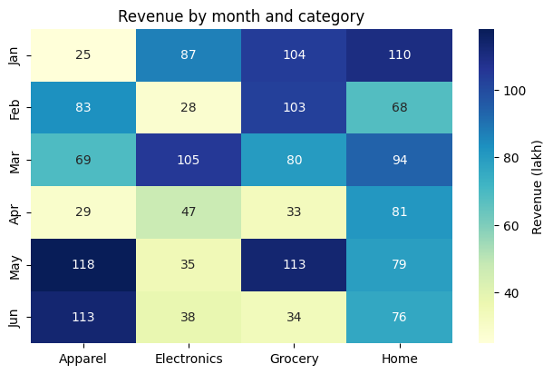

Revenue by month and category as an annotated heatmap, integers with no decimals, on the yellow-green-blue colormap.

**Data:**

```python
rng = np.random.RandomState(8)
months = ["Jan", "Feb", "Mar", "Apr", "May", "Jun"]
cats = ["Electronics", "Grocery", "Apparel", "Home"]
raw = pd.DataFrame({
    "month": np.repeat(months, 4),
    "category": cats * 6,
    "revenue": rng.randint(20, 120, 24),
})
```

**Your chart must have:**

- a 6x4 grid of 24 annotated cells
- integers, no decimal points
- rows in calendar order
- a colourbar labelled with the unit

**Expected:** title `Revenue by month and category`. Rows read **Jan, Feb, Mar, Apr, May, Jun** top to bottom.

> ⚠️ **Self-check:** `pivot_table` sorts its index **alphabetically**, giving you Apr, Feb, Jan, Jun, Mar, May. The heatmap renders beautifully and every month is in the wrong place. Reorder explicitly with `.loc[months]` and check the index after **every** aggregation — the same silent reordering bites `groupby` in Module 25.

**Explanation:** `pivot_table` builds the matrix and sorts the index **alphabetically**, which scrambles months into Apr, Feb, Jan… — a heatmap that looks entirely normal and is wrong. Reorder explicitly.

---

## 📋 Assignment 21 — Diverging bar chart

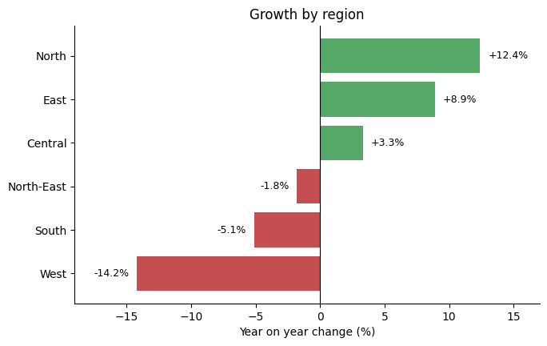

Percentage change by region as horizontal bars, green where positive and red where negative, split by a line at zero.

**Data:**

```python
regions = ["North", "South", "East", "West", "Central", "North-East"]
change  = [12.4, -5.1, 8.9, -14.2, 3.3, -1.8]
```

**Your chart must have:**

- 6 bars, 3 green and 3 red
- a vertical line at zero
- labels on the outer end of every bar, with a sign
- bars sorted from most negative at the bottom

**Expected:** title `Growth by region` · xlabel `Year on year change (%)`. Labels read **+12.4%**, **+8.9%**, **+3.3%**, **-1.8%**, **-5.1%**, **-14.2%**.

> ⚠️ **Self-check:** The colours must be computed **from the data**, one per bar. Passing a single colour string gives you six identical bars and throws away the only thing the chart was for. Labels on negative bars need `ha='right'` or they overlap the bar.

**Explanation:** Computing the colour per bar from the sign of the value is what makes a diverging chart work. The zero line gives the eye a reference; without it positive and negative bars are hard to separate at a glance.

---

## Tier 5 — Composition and annotation (Q22–Q26)

More than one axes, or an annotation that has to point at a location you computed. These are the charts you cannot produce by copying a snippet, because the snippet does not know where your peak is.

## 📋 Assignment 22 — Two by two subplot grid

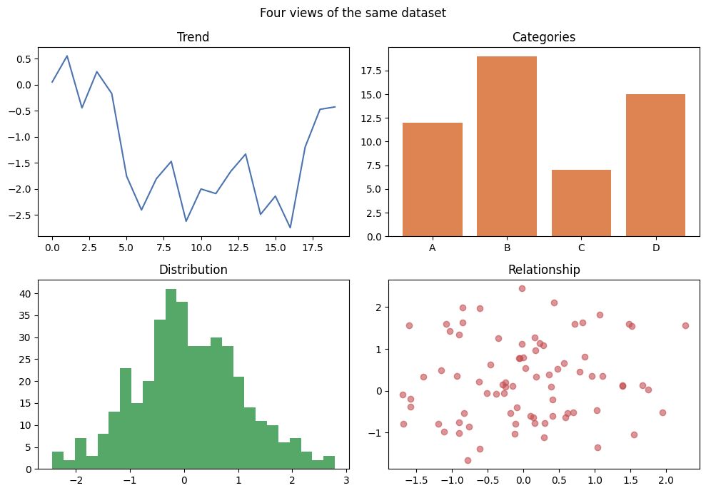

Four panels in a 2x2 grid — line, bar, histogram, scatter — each with its own title, under one overall figure title.

**Data:**

```python
rng = np.random.RandomState(4)
x = np.arange(20)
```

**Your chart must have:**

- 4 panels
- 4 individual titles plus 1 figure title
- no overlapping text anywhere

**Expected:** suptitle `Four views of the same dataset`; panel titles `Trend`, `Categories`, `Distribution`, `Relationship`.

> ⚠️ **Self-check:** `plt.subplots(2, 2)` returns a **2D** array. `axes[0]` is an entire row, so `axes[0].plot(...)` raises `AttributeError: 'numpy.ndarray' object has no attribute 'plot'`. Use `axes[0, 0]` or flatten it with `axes.ravel()` first. And without `fig.tight_layout()` the suptitle lands on top of the panel titles.

**Explanation:** `plt.subplots(2, 2)` returns a **2D array** of axes, so `axes[0]` is a whole row. `tight_layout` stops the suptitle colliding with the panel titles.

---

## 📋 Assignment 23 — Annotated peak

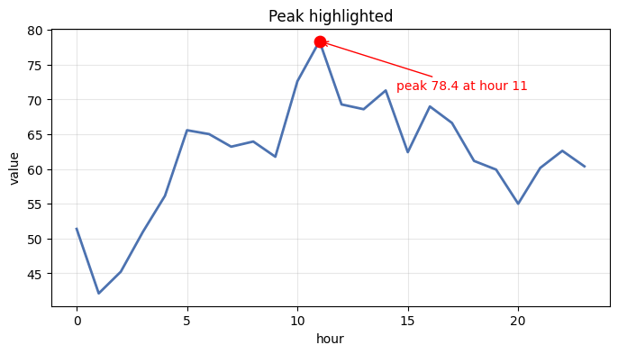

A line chart where the single highest point is marked with a red dot and an arrow pointing at it, labelled with its value.

**Data:**

```python
rng = np.random.RandomState(17)
x = np.arange(24)
y = 50 + np.cumsum(rng.randn(24) * 5)
```

**Your chart must have:**

- 1 line
- 1 red dot sitting exactly on the maximum
- 1 arrow annotation naming the peak value and its position
- gridlines

**Expected:** title `Peak highlighted` · xlabel `hour` · ylabel `value`. The annotation reads **peak 78.4 at hour 11**, placed below and to the right of the dot so it does not collide with the title.

> ⚠️ **Self-check:** `np.argmax` returns the **index**; `np.max` returns the **value**. Using the value as an index puts your dot at a real, valid, completely wrong location — hour 76 does not exist here, so you get an `IndexError` if you are lucky and a misplaced dot if the numbers happen to be small enough.

**Explanation:** `argmax` returns the **index**, not the value — using one where you meant the other places the annotation somewhere real and completely wrong. The arrow makes the chart self-explanatory without a caption.

---

## 📋 Assignment 24 — Time series with a rolling mean

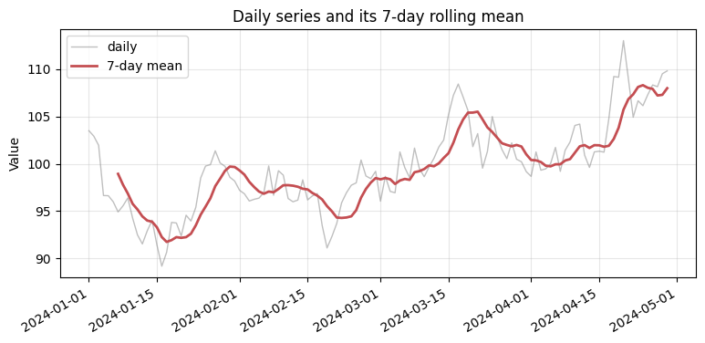

120 noisy daily values in light grey with a bold 7-day rolling mean over the top, dates rotated on the x axis.

**Data:**

```python
rng = np.random.RandomState(11)
idx = pd.date_range("2024-01-01", periods=120, freq="D")
s = pd.Series(100 + np.cumsum(rng.randn(120) * 2), index=idx)
```

**Your chart must have:**

- 2 lines, the raw series faint and the smoothed one bold
- readable, rotated date labels
- a legend

**Expected:** title `Daily series and its 7-day rolling mean` · ylabel `Value`. The red line starts **6 days after** the grey one.

> ⚠️ **Self-check:** That 6-day gap is the rolling window filling up and it is **correct**. If your red line starts on day 1 you used `min_periods=1`, which computes a '7-day mean' from a single observation and hides the fact that you do not have a week of data yet.

**Explanation:** `rolling(7).mean()` leaves the first 6 values as `NaN` and Matplotlib simply skips them, which is why the smoothed line starts later. That gap is honest: you genuinely do not have a week of data yet.

---

## 📋 Assignment 25 — Pareto chart

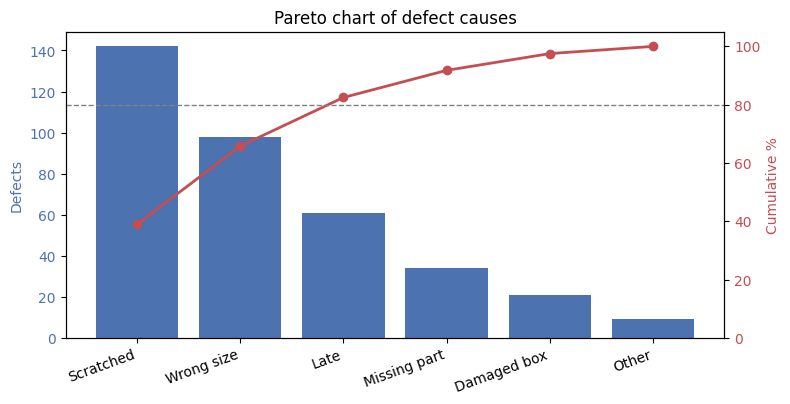

Defect counts as bars sorted largest first, with a cumulative percentage line on a right-hand axis and a dashed reference line at 80 percent. The classic 80/20 chart.

**Data:**

```python
labels = ["Scratched", "Wrong size", "Late", "Missing part", "Damaged box", "Other"]
counts = [142, 98, 61, 34, 21, 9]
```

**Your chart must have:**

- 6 bars in descending order
- a cumulative line on a second y axis running 0 to about 105
- a dashed horizontal line at 80
- rotated category labels

**Expected:** title `Pareto chart of defect causes` · left ylabel `Defects` · right ylabel `Cumulative %`. The line ends at exactly **100%** and crosses 80% at the third bar — the top 3 of 6 causes are **82.5%** of all defects.

> ⚠️ **Self-check:** The `cumsum` must run on the **sorted** counts. Run it before sorting and the line wanders up and down instead of rising monotonically — which is visually obvious once you know to look, and invisible if you do not.

**Explanation:** A Pareto combines two encodings to answer "where should I spend my effort". The cumulative line must be built from **sorted** counts, or it wanders instead of rising and the 80% crossing is meaningless.

---

## 📋 Assignment 26 — Slope chart

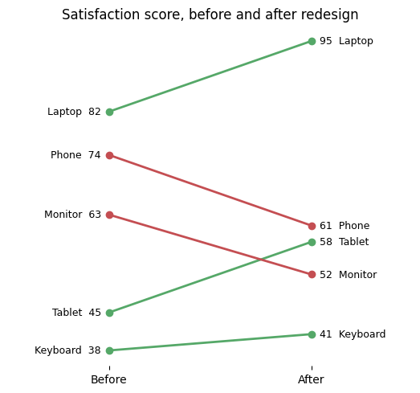

Two columns, Before and After, with one line per product connecting its two values. Lines that rose are green, lines that fell are red. Every endpoint carries its name and value.

**Data:**

```python
data = [("Laptop", 82, 95), ("Phone", 74, 61), ("Tablet", 45, 58),
        ("Monitor", 63, 52), ("Keyboard", 38, 41)]
```

**Your chart must have:**

- 5 two-point lines
- 3 green and 2 red
- 10 text labels, one at each endpoint
- only two x ticks, no y ticks, no spines

**Expected:** title `Satisfaction score, before and after redesign`. Phone (74→61) and Monitor (63→52) are the red lines.

> ⚠️ **Self-check:** Compute the colour **inside** the loop, per product. Working it out once outside gives you five identical lines and no comparison. There is no `slope_chart()` function anywhere in matplotlib or seaborn — this is a loop of two-point lines and nothing more, which is worth knowing because most 'exotic' charts are exactly this.

**Explanation:** There is no slope-chart function anywhere — it is a loop of two-point lines with the colour computed per row. Worth internalising, because most unusual charts are ordinary primitives arranged in a loop.

---

## Tier 6 — Report charts from the messy starter data (Q27–Q30)

The real thing. These four use `merged_clean.csv` from the starter project, so every number below is measured from the same 3,000 rows you cleaned. This is what the job actually looks like: aggregate, order deliberately, label in the reader's units, and title the chart with the finding rather than the variable names.

## 📋 Assignment 27 — Revenue by category from the starter data

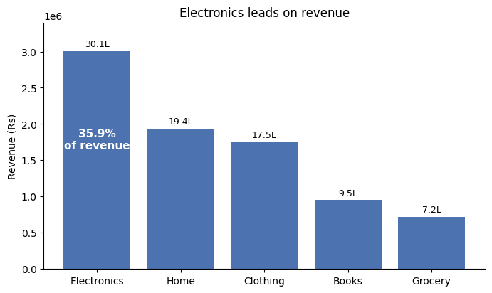

The five product categories of the cleaned starter dataset as sorted bars, labelled in lakh, with the leading category's share annotated on the chart.

**Data:**

```python
df = pd.read_csv("starter-project/data/merged_clean.csv")
```

**Your chart must have:**

- 5 bars, descending
- each bar labelled in lakh, one decimal
- the share of the top category written inside its bar
- a title that names the finding

**Expected:** title `Electronics leads on revenue` · ylabel `Revenue (Rs)`. Bar labels **30.1L, 19.4L, 17.5L, 9.5L, 7.2L** and the annotation **35.9% of revenue**. Total revenue is ₹83,67,710.

> ⚠️ **Self-check:** `groupby` returns categories in **alphabetical** order — Books, Clothing, Electronics, Grocery, Home. Forget `.sort_values()` and your 'ranking' chart is an alphabetical list that happens to look like a ranking. Verify the bars sum to ₹83,67,710.

**Explanation:** `groupby` returns categories **alphabetically**, so a ranking chart needs an explicit `sort_values`. Labelling in lakh rather than raw rupees is what makes the axis readable, and the title states the finding rather than the variables.

---

## 📋 Assignment 28 — Monthly revenue trend

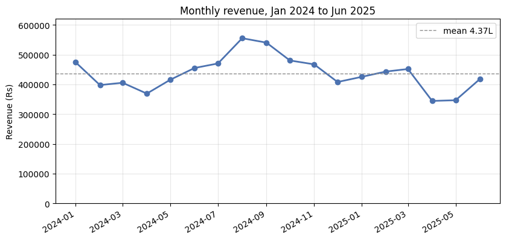

Total revenue per month across the 18 months of the starter data, as a line with markers, with the mean drawn as a dashed reference.

**Data:**

```python
df = pd.read_csv("starter-project/data/merged_clean.csv",
                 parse_dates=["order_date", "order_month"])
valid = df[~df["date_ambiguous"]]
```

**Your chart must have:**

- 18 points on one line
- a dashed horizontal mean line
- the y axis starting at zero
- rotated date labels

**Expected:** title `Monthly revenue, Jan 2024 to Jun 2025` · ylabel `Revenue (Rs)`. Peak **₹5,55,119** in Aug 2024, trough **₹3,44,360** in Apr 2025, mean **4.37L**.

> ⚠️ **Self-check:** Two traps here, and both produce a chart that looks fine. First, filter out `date_ambiguous` rows — with them included, 16 orders land in months after the data ends and manufacture a **98% revenue collapse** at the right edge. Second, **start the y axis at zero**: let matplotlib autoscale and this flat-ish series turns into a dramatic mountain range that is entirely an artefact of the axis.

**Explanation:** Two decisions change this chart's story: **filter the ambiguous dates** (or 16 orders land past the end of the data and fake a collapse), and **start the y axis at zero** (or a 60% variation looks like a 10× swing). Both are judgement calls that belong in the caption.

---

## 📋 Assignment 29 — City by category heatmap

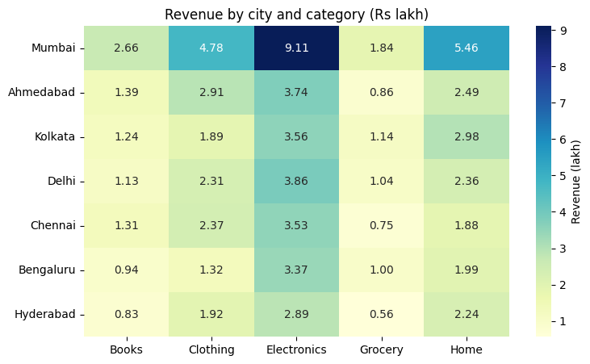

Revenue for every city and category combination in the starter data, as an annotated heatmap in lakh.

**Data:**

```python
df = pd.read_csv("starter-project/data/merged_clean.csv")
```

**Your chart must have:**

- a 7x5 grid of 35 annotated cells
- cities ordered by total revenue, largest at the top
- a colourbar labelled with the unit

**Expected:** title `Revenue by city and category (Rs lakh)`. Mumbai is the top row; Mumbai × Electronics is the largest single cell at **9.11** lakh. Hyderabad is the bottom row.

> ⚠️ **Self-check:** `pivot_table` gives you cities alphabetically — Ahmedabad first, Mumbai in the middle. Sort by the row totals so the eye finds the important row immediately. And divide by 1e5 **before** plotting, not after: annotating raw rupees writes `910812` into every cell and the grid becomes unreadable.

**Explanation:** Two-dimensional aggregation, then deliberate ordering. Sorting rows by their totals puts the important row where the eye lands first, and scaling to lakh **before** plotting keeps the cell annotations readable.

---

## 📋 Assignment 30 — The null result

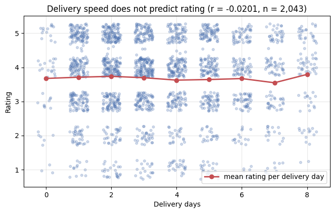

Delivery days against customer rating for every order that has both, with the correlation stated in the title. This chart's job is to show that there is nothing there.

**Data:**

```python
df = pd.read_csv("starter-project/data/merged_clean.csv")
d = df.dropna(subset=["delivery_days", "rating"])
```

**Your chart must have:**

- a jittered scatter of every valid order
- a red line of the mean rating for each delivery day
- the correlation and the sample size in the title
- a title that states the null result plainly

**Expected:** title `Delivery speed does not predict rating (r = -0.0201, n = 2,043)`. The red mean line is close to flat, wandering between **3.55 and 3.79** across the nine delivery-day values.

> ⚠️ **Self-check:** Both variables are integers, so a raw scatter draws every point on top of about forty others and shows you a neat grid of dots that says nothing about density. **Jitter** them. The other trap is reporting nothing at all: r = -0.0201 on n = 2,043 is a real, publishable finding, and a chart that says so honestly is worth more than a chart that hunts for a correlation until one appears.

**Explanation:** Both variables are integers, so a raw scatter stacks thousands of points onto 35 positions and shows nothing about density — jitter fixes that. The chart's job here is to show there is **no** relationship, and reporting that honestly is a real finding, not a failed analysis.

---

## Common Mistakes

Every one of these renders without an error. That is what makes them worth a section — a traceback tells you to fix something, a silently wrong chart gets presented to your manager.

### 1. Sorting the values and forgetting the labels

```python
values.sort(reverse=True)          # ❌ every label now points at the wrong bar

order = sorted(zip(values, labels), reverse=True)   # ✅ they move together
values, labels = [v for v, _ in order], [l for _, l in order]
```

Nothing raises, the chart looks professional, and every number is attached to the wrong category. **Q2, Q11, Q21, Q26 and Q27 all depend on getting this right.**

### 2. Sorting `barh` in the direction that feels correct

`ax.barh` draws the **first** item at the **bottom**. To put the largest at the top you sort **ascending** — the opposite of what you would do for `ax.bar`. Sorting descending flips the entire chart upside down without complaint.

### 3. Letting an aggregation choose your order

```python
df.groupby('category')['revenue'].sum()      # alphabetical, not ranked
df.pivot_table(index='month', ...).index     # ['Apr','Feb','Jan','Jun','Mar','May']
```

Both return something sorted by **label**, and both look entirely reasonable plotted. Add `.sort_values()` or `.loc[months]` and check the index after every aggregation. This is the same trap as the `groupby` ordering warning in Module 25.

### 4. Autoscaled y axes on a bar chart

Matplotlib starts a bar chart's y axis wherever it likes. On values clustered between 340,000 and 555,000 that turns a 60% variation into a chart that looks like a 10× swing. **Bar charts and area charts start at zero.** Line charts may not have to, but you should still say so out loud when they do not — see Q28.

### 5. Forgetting `ax=ax` on a seaborn call

Seaborn quietly creates its own figure when you do not give it one. You end up with two images — your empty one and seaborn's — and if you are saving `plt.gcf()` you may well save the wrong one. Every seaborn call in this file passes `ax=ax`.

### 6. Overplotting integer data without jitter

Ratings 1–5 against delivery days 1–7 gives 35 possible positions. Two thousand orders land on those 35 dots and the chart shows you a tidy grid that carries no information about density. Jitter, or use transparency, or both — Q30.

### 7. `argmax` versus `max`

`np.argmax` returns the **index**, `np.max` returns the **value**. Using one where you meant the other places your annotation at a real, valid, completely wrong location.

### 8. Titling the chart with the variable names

`Revenue by category` describes the axes, which the reader can already see. `Electronics leads on revenue` states the finding. The second one takes the same number of characters and does the reader's work for them.

---

## Quick Reference

| You want                   | Call                                                                            |
| -------------------------- | ------------------------------------------------------------------------------- |
| A line                     | `ax.plot(x, y)`                                                                 |
| Vertical bars              | `ax.bar(labels, values)`                                                        |
| Horizontal bars            | `ax.barh(labels, values)` — first item at the bottom                            |
| Stacked bars               | `ax.bar(x, b, bottom=a)` with numpy arrays                                      |
| Grouped bars               | `ax.bar(x - w/2, a, w)` and `ax.bar(x + w/2, b, w)`                             |
| Histogram                  | `ax.hist(data, bins=40)` — the default 10 is rarely right                       |
| Scatter                    | `ax.scatter(x, y, s=40, alpha=0.7)`                                             |
| Colour as a third variable | `ax.scatter(..., c=z, cmap='viridis')` + `fig.colorbar(sc, ax=ax)`              |
| Donut                      | `ax.pie(v, autopct='%1.1f%%', wedgeprops=dict(width=0.45))`                     |
| Reference line             | `ax.axhline(y)` / `ax.axvline(x)`                                               |
| Shaded band                | `ax.fill_between(x, lo, hi, alpha=0.25)` — before the line                      |
| Error bars                 | `ax.bar(..., yerr=sd, capsize=4, ecolor='black')`                               |
| Stems and dots             | `ax.hlines(y, 0, v)` then `ax.scatter(v, y)`                                    |
| Value labels               | `ax.text(x, y, s, ha='center')` in a loop                                       |
| Arrow annotation           | `ax.annotate(s, xy=..., xytext=..., arrowprops=dict(arrowstyle='->'))`          |
| Second y axis              | `ax2 = ax.twinx()`                                                              |
| Panel grid                 | `fig, axes = plt.subplots(2, 2)` then `axes[0, 0]`                              |
| Legend                     | `label=` on each artist, then `ax.legend()`                                     |
| Grid                       | `ax.grid(alpha=0.3)` or `ax.grid(axis='y', alpha=0.3)`                          |
| Remove a spine             | `ax.spines['top'].set_visible(False)`                                           |
| Rotate date ticks          | `fig.autofmt_xdate()`                                                           |
| Stop overlapping text      | `fig.tight_layout()`                                                            |
| Figure-level title         | `fig.suptitle('...')`                                                           |
| Box / violin / count       | `sns.boxplot(data=df, x=..., y=..., ax=ax)` — same signature for all three      |
| Points over a box plot     | `sns.stripplot(..., ax=ax, color='black', alpha=0.4, size=3)`                   |
| Correlation heatmap        | `sns.heatmap(df.corr(), annot=True, fmt='.2f', cmap='RdBu_r', center=0, ax=ax)` |
| Matrix for a heatmap       | `df.pivot_table(index=..., columns=..., values=..., aggfunc='sum')`             |
| Trend line                 | `m, c = np.polyfit(x, y, 1)`                                                    |
| Rolling mean               | `s.rolling(7).mean()` — leaves 6 leading NaNs                                   |
| Force a zero baseline      | `ax.set_ylim(0, None)`                                                          |

---

[← Phase 6 index](README.md) · [Module 27: Data Visualization](module-27-data-visualization.md) · [Solutions](chart-practice-solutions.md) · [60 Practice Questions](practice-questions.md)
