# Module 27: Data Visualization

## Introduction to Matplotlib

**Matplotlib** is the foundational plotting library for Python. Almost every other visualisation library (including Seaborn and Pandas plotting) is built on top of it.

```bash
pip install matplotlib
```

```python
import matplotlib.pyplot as plt      # plt is the universal convention
import numpy as np
import pandas as pd
```

### Why visualise data at all?

Numbers hide patterns; pictures reveal them.

- Spot **trends** over time
- Compare **categories** at a glance
- Find **outliers** and errors instantly
- See **relationships** between variables
- Communicate findings to people who will never read your code

### The anatomy of a plot

| Part       | What it is                            |
| ---------- | ------------------------------------- |
| **Figure** | The whole canvas                      |
| **Axes**   | One individual plot inside the figure |
| **Axis**   | The x or y number line                |
| **Title**  | Text above the plot                   |
| **Labels** | Text describing each axis             |
| **Legend** | The key explaining each series        |
| **Ticks**  | The marks and numbers on an axis      |

### Two ways to write Matplotlib code

```python
# 1. Pyplot style — quick and simple, good for one plot
plt.plot([1, 2, 3], [4, 5, 6])
plt.title("Quick plot")
plt.show()

# 2. Object-oriented style — explicit, better for multiple plots
fig, ax = plt.subplots()
ax.plot([1, 2, 3], [4, 5, 6])
ax.set_title("OO plot")
plt.show()
```

Both are used everywhere. Start with pyplot; switch to the object-oriented style when you need subplots.

### Saving a figure

```python
plt.savefig('chart.png', dpi=300, bbox_inches='tight')
```

Always call `savefig()` **before** `plt.show()`, otherwise you save a blank image.

---

## Line Charts

Line charts show how a value **changes** — over time, or across a continuous range.

```python
import matplotlib.pyplot as plt
import numpy as np

x = np.linspace(0, 10, 100)

plt.figure(figsize=(7, 4))
plt.plot(x, np.sin(x), label='sin(x)', color='blue', linewidth=2)
plt.plot(x, np.cos(x), label='cos(x)', color='red', linestyle='--', linewidth=2)

plt.title('Line Chart: Sine and Cosine')
plt.xlabel('x')
plt.ylabel('y')
plt.legend()
plt.grid(True, alpha=0.3)
plt.tight_layout()
plt.savefig('line_chart.png', dpi=90)
plt.show()
```

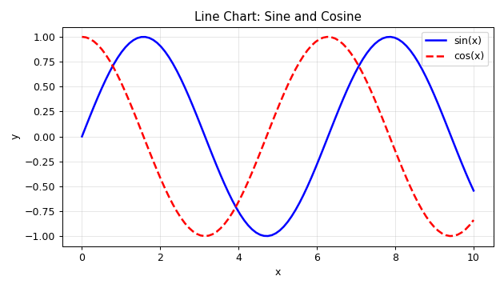

### Line styles and markers

| Code   | Line style |
| ------ | ---------- |
| `'-'`  | Solid      |
| `'--'` | Dashed     |
| `'-.'` | Dash-dot   |
| `':'`  | Dotted     |

| Code  | Marker   |
| ----- | -------- |
| `'o'` | Circle   |
| `'s'` | Square   |
| `'^'` | Triangle |
| `'*'` | Star     |
| `'+'` | Plus     |

Shorthand combines colour, marker, and line style:

```python
plt.plot(x, y, 'ro--')      # red circles with a dashed line
plt.plot(x, y, 'g^-')       # green triangles with a solid line
```

### Plotting from a DataFrame

```python
df = pd.DataFrame({
    'Month': ['Jan', 'Feb', 'Mar', 'Apr', 'May'],
    'Sales': [100, 120, 90, 150, 180]
})

plt.plot(df['Month'], df['Sales'], marker='o')
plt.title('Monthly Sales')
plt.show()

# Or use the Pandas shortcut
df.plot(x='Month', y='Sales', kind='line', marker='o')
```

---

## Bar Charts

Bar charts **compare categories**.

```python
depts = ['IT', 'HR', 'Finance', 'Sales']
sal = [75000, 55000, 65000, 60000]

plt.figure(figsize=(7, 4))
bars = plt.bar(depts, sal,
               color=['#4C72B0', '#DD8452', '#55A868', '#C44E52'],
               edgecolor='black')

plt.title('Average Salary by Department')
plt.ylabel('Salary (₹)')

# Add the value on top of each bar
for bar in bars:
    plt.text(bar.get_x() + bar.get_width() / 2,
             bar.get_height() + 1000,
             f'{int(bar.get_height()):,}',
             ha='center', fontsize=9)

plt.ylim(0, 85000)
plt.tight_layout()
plt.savefig('bar_chart.png', dpi=90)
plt.show()
```

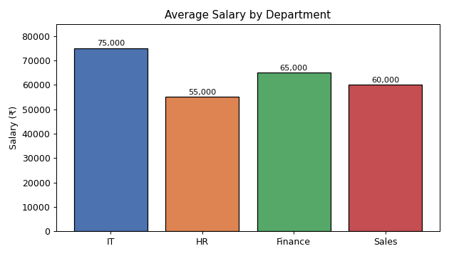

### Grouped bar chart

Comparing two series side by side requires offsetting the x positions.

```python
x = np.arange(4)
w = 0.35

plt.figure(figsize=(7, 4))
plt.bar(x - w/2, [50, 55, 60, 58], w, label='2023', color='#4C72B0')
plt.bar(x + w/2, [55, 62, 65, 61], w, label='2024', color='#DD8452')

plt.xticks(x, depts)
plt.title('Grouped Bar: Salary by Year')
plt.ylabel('Salary (₹000)')
plt.legend()
plt.tight_layout()
plt.savefig('grouped_bar.png', dpi=90)
plt.show()
```

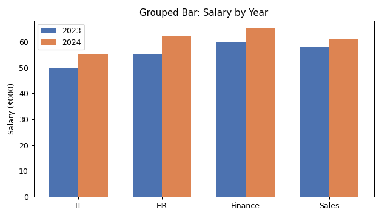

### Horizontal and stacked bars

```python
plt.barh(depts, sal)                             # horizontal — good for long labels

plt.bar(depts, values1, label='A')               # stacked
plt.bar(depts, values2, bottom=values1, label='B')
```

> 💡 Bar charts should almost always start at zero. Truncating the y-axis exaggerates small differences and is one of the most common ways charts mislead people.

---

## Pie Charts

Pie charts show **parts of a whole**.

```python
plt.figure(figsize=(6, 5))
plt.pie([35, 25, 20, 20],
        labels=['Python', 'Java', 'C++', 'JS'],
        autopct='%1.1f%%',
        startangle=90,
        explode=(0.05, 0, 0, 0),
        colors=['#4C72B0', '#DD8452', '#55A868', '#C44E52'],
        shadow=True)

plt.title('Language Popularity')
plt.axis('equal')
plt.tight_layout()
plt.savefig('pie_chart.png', dpi=90)
plt.show()
```

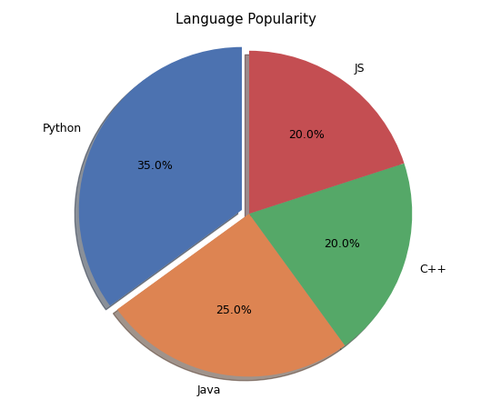

| Parameter    | Purpose           |
| ------------ | ----------------- |
| `labels`     | Slice names       |
| `autopct`    | Percentage format |
| `startangle` | Rotation          |
| `explode`    | Pull a slice out  |
| `shadow`     | 3D effect         |
| `colors`     | Slice colours     |

> ⚠️ Use pie charts sparingly. Humans are bad at comparing angles. With more than 5 slices, or when values are close together, a **bar chart is almost always clearer**.

---

## Histograms

A histogram shows the **distribution** of one numeric variable — how values are spread out.

```python
np.random.seed(42)
data = np.random.normal(100, 15, 1000)

plt.figure(figsize=(7, 4))
plt.hist(data, bins=30, color='skyblue', edgecolor='black', alpha=0.8)
plt.axvline(data.mean(), color='red', linestyle='--', linewidth=2,
            label=f'Mean={data.mean():.1f}')

plt.title('Histogram: Score Distribution')
plt.xlabel('Score')
plt.ylabel('Frequency')
plt.legend()
plt.tight_layout()
plt.savefig('histogram.png', dpi=90)
plt.show()
```

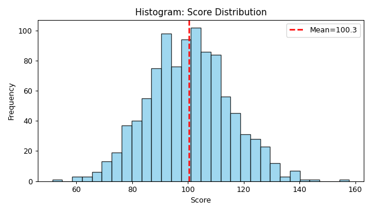

The classic bell shape confirms the data is normally distributed.

### Histogram vs bar chart

| Histogram          | Bar chart            |
| ------------------ | -------------------- |
| **Numeric** data   | **Categorical** data |
| Bars touch         | Bars have gaps       |
| Shows distribution | Compares categories  |
| X axis is a range  | X axis is labels     |

### Choosing bin count

```python
plt.hist(data, bins=10)     # coarse — hides detail
plt.hist(data, bins=30)     # usually about right
plt.hist(data, bins=100)    # too noisy for 1000 points
```

Too few bins hides the shape; too many turns it into noise. Try several.

---

## Scatter Plots

Scatter plots reveal the **relationship between two numeric variables**.

```python
np.random.seed(1)
n = 100
xs = np.random.rand(n) * 100
ys = xs * 0.8 + np.random.randn(n) * 10

plt.figure(figsize=(7, 4))
sc = plt.scatter(xs, ys,
                 c=ys,                              # colour by value
                 s=np.random.rand(n) * 100 + 20,    # size by value
                 cmap='viridis',
                 alpha=0.7,
                 edgecolors='black',
                 linewidth=0.5)

plt.colorbar(sc, label='Y value')
plt.title('Scatter Plot with Size and Colour')
plt.xlabel('Study Hours')
plt.ylabel('Score')
plt.tight_layout()
plt.savefig('scatter.png', dpi=90)
plt.show()
```

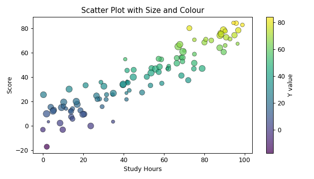

A scatter plot encodes **four** variables at once: x position, y position, colour, and size.

### Adding a trend line

```python
z = np.polyfit(xs, ys, 1)
p = np.poly1d(z)
plt.plot(xs, p(xs), "r--", linewidth=2, label='Trend')
```

### What patterns mean

| Pattern                | Interpretation          |
| ---------------------- | ----------------------- |
| Points rise left→right | Positive correlation    |
| Points fall left→right | Negative correlation    |
| Random cloud           | No correlation          |
| Curved band            | Non-linear relationship |
| Isolated points        | Outliers                |

---

## Subplots

Subplots put several charts in one figure.

```python
fig, ax = plt.subplots(2, 2, figsize=(9, 6))
xx = np.linspace(0, 10, 50)

ax[0, 0].plot(xx, np.sin(xx), color='blue')
ax[0, 0].set_title('Line')

ax[0, 1].bar(['A', 'B', 'C'], [3, 7, 5], color='orange')
ax[0, 1].set_title('Bar')

ax[1, 0].hist(np.random.randn(500), bins=25, color='green', edgecolor='black')
ax[1, 0].set_title('Histogram')

ax[1, 1].scatter(np.random.rand(40), np.random.rand(40), color='red', alpha=0.6)
ax[1, 1].set_title('Scatter')

fig.suptitle('Four Charts in a 2x2 Grid', fontsize=13)
plt.tight_layout()
plt.savefig('subplots.png', dpi=90)
plt.show()
```

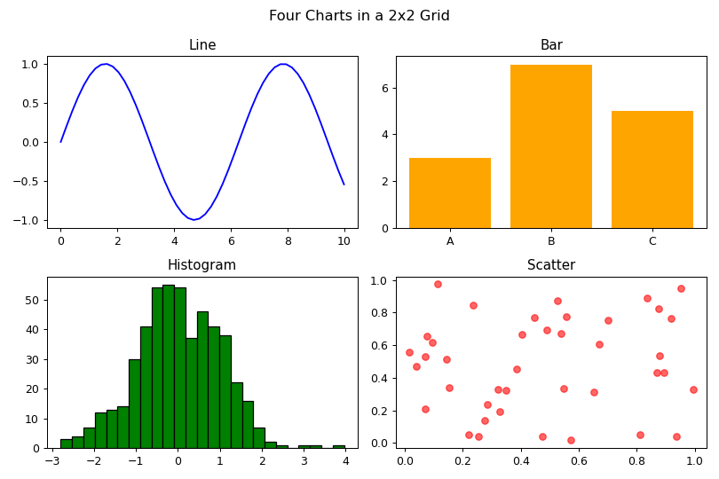

### Indexing the axes

```python
fig, ax = plt.subplots(2, 2)     # 2D grid → ax[row, col]
fig, ax = plt.subplots(1, 3)     # single row → ax[0], ax[1], ax[2]
fig, ax = plt.subplots()         # one plot → just ax
```

### Sharing axes

```python
fig, ax = plt.subplots(2, 2, sharex=True, sharey=True)
```

This keeps scales identical so the subplots are genuinely comparable.

> 💡 `plt.tight_layout()` fixes overlapping titles and labels. Add it to almost every multi-plot figure.

---

## Customizing Charts

### Titles, labels, and limits

```python
plt.title('Main Title', fontsize=16, fontweight='bold', color='navy')
plt.xlabel('X Axis', fontsize=12)
plt.ylabel('Y Axis', fontsize=12)
plt.xlim(0, 100)
plt.ylim(0, 50)
plt.xticks(rotation=45)
plt.grid(True, linestyle='--', alpha=0.5)
plt.legend(loc='upper right', fontsize=10, frameon=True)
```

### Colours

```python
plt.plot(x, y, color='red')          # name
plt.plot(x, y, color='#FF5733')      # hex
plt.plot(x, y, color=(0.1, 0.2, 0.5))# RGB tuple
plt.plot(x, y, color='C0')           # default colour cycle
```

### Annotating

```python
plt.annotate('Peak',
             xy=(5, 100),                    # point to annotate
             xytext=(6, 120),                # where the text goes
             arrowprops=dict(arrowstyle='->', color='red'))

plt.text(2, 50, 'Note here', fontsize=12)
plt.axhline(y=50, color='gray', linestyle='--')
plt.axvline(x=5, color='gray', linestyle='--')
```

### Built-in styles

```python
print(plt.style.available)

plt.style.use('ggplot')
plt.style.use('seaborn-v0_8-darkgrid')
plt.style.use('fivethirtyeight')
```

### Figure size and resolution

```python
plt.figure(figsize=(10, 6), dpi=100)
plt.savefig('out.png', dpi=300, bbox_inches='tight', transparent=False)
```

---

## Introduction to Seaborn

**Seaborn** is built on Matplotlib and designed for **statistical** graphics. It produces better-looking plots with far less code and works directly with DataFrames.

```bash
pip install seaborn
```

```python
import seaborn as sns
sns.set_theme(style='whitegrid')
```

### Matplotlib vs Seaborn

| Matplotlib               | Seaborn                   |
| ------------------------ | ------------------------- |
| Low-level, total control | High-level, statistical   |
| More code per chart      | One line per chart        |
| Works with arrays/lists  | Works with **DataFrames** |
| Plain default styling    | Attractive defaults       |
| Any chart imaginable     | Statistical charts        |

They work together — you build with Seaborn and customise with Matplotlib.

### Built-in datasets

Seaborn ships with practice datasets, which is what we will use here.

```python
tips = sns.load_dataset('tips')
print(tips.head())
print(tips.shape)
```

Output:

```
   total_bill   tip     sex smoker  day    time  size
0       16.99  1.01  Female     No  Sun  Dinner     2
1       10.34  1.66    Male     No  Sun  Dinner     3
2       21.01  3.50    Male     No  Sun  Dinner     3
3       23.68  3.31    Male     No  Sun  Dinner     2
4       24.59  3.61  Female     No  Sun  Dinner     4
(244, 7)
```

Other datasets: `'iris'`, `'titanic'`, `'flights'`, `'penguins'`, `'diamonds'`.

---

## Distribution Plots

### `histplot()` — histogram with an optional density curve

```python
plt.figure(figsize=(7, 4))
sns.histplot(tips['total_bill'], bins=25, kde=True, color='steelblue')
plt.title('Seaborn histplot: Total Bill Distribution')
plt.tight_layout()
plt.savefig('sns_dist.png', dpi=90)
plt.show()
```

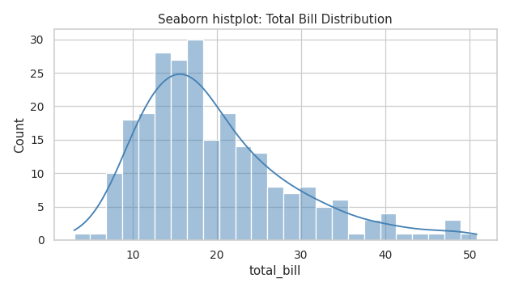

`kde=True` overlays a smooth **Kernel Density Estimate** curve. The distribution is right-skewed — most bills are small, with a long tail of expensive ones.

### Other distribution plots

```python
sns.kdeplot(data=tips, x='total_bill', hue='sex', fill=True)   # smooth curve only
sns.displot(data=tips, x='total_bill', col='time', kde=True)   # separate panels
sns.rugplot(data=tips, x='total_bill')                         # tick per observation
sns.ecdfplot(data=tips, x='total_bill')                        # cumulative
```

---

## Box Plots

A **box plot** summarises a distribution using five numbers and exposes outliers.

```python
plt.figure(figsize=(7, 4))
sns.boxplot(data=tips, x='day', y='total_bill', hue='day',
            palette='Set2', legend=False)
plt.title('Box Plot: Total Bill by Day')
plt.tight_layout()
plt.savefig('sns_box.png', dpi=90)
plt.show()
```

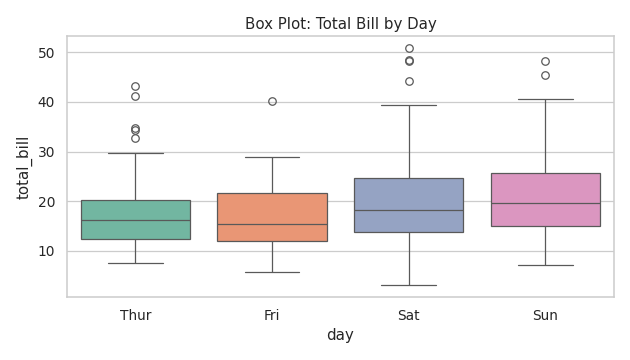

### Reading a box plot

```
      ┌─────┬─────┐
  ├───┤     │     ├───┤        ●  ●
      └─────┴─────┘
  │   │     │     │   │        │
 Min  Q1  Median Q3  Max    Outliers
     (whisker)      (whisker)
```

| Part                | Meaning                      |
| ------------------- | ---------------------------- |
| Box                 | The middle 50% of data (IQR) |
| Line inside the box | Median                       |
| Whiskers            | Extend to 1.5 × IQR          |
| Dots beyond         | Outliers                     |

This connects directly to the IQR outlier method from Module 26 — a box plot is that calculation drawn as a picture.

### Violin plot — box plot plus distribution shape

```python
plt.figure(figsize=(7, 4))
sns.violinplot(data=tips, x='day', y='total_bill', hue='sex',
               split=True, palette='pastel')
plt.title('Violin Plot')
plt.tight_layout()
plt.show()
```

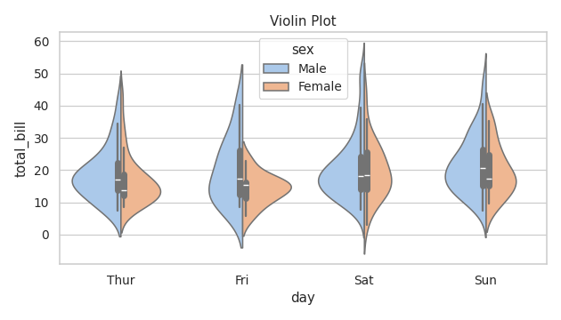

The width shows where values are concentrated — information a box plot hides.

---

## Heatmaps

A **heatmap** shows a matrix of values as colours. Its most common use is a **correlation matrix**.

```python
plt.figure(figsize=(6, 5))
corr = tips[['total_bill', 'tip', 'size']].corr()

sns.heatmap(corr, annot=True, cmap='coolwarm', center=0,
            fmt='.2f', square=True, linewidths=1)
plt.title('Correlation Heatmap')
plt.tight_layout()
plt.savefig('sns_heatmap.png', dpi=90)
plt.show()

print(corr.round(3))
```

Output:

```
            total_bill    tip   size
total_bill       1.000  0.676  0.598
tip              0.676  1.000  0.489
size             0.598  0.489  1.000
```


Total bill and tip have a correlation of **0.68** — a strong positive relationship, exactly as you would expect.

| Parameter       | Purpose                                         |
| --------------- | ----------------------------------------------- |
| `annot=True`    | Write the numbers in the cells                  |
| `cmap`          | Colour scheme (`coolwarm`, `viridis`, `YlGnBu`) |
| `center=0`      | Centre the colour scale at zero                 |
| `fmt='.2f'`     | Number format                                   |
| `linewidths`    | Gap between cells                               |
| `vmin` / `vmax` | Fix the colour scale range                      |

---

## Pair Plots

A **pair plot** draws a scatter plot for every pair of numeric columns, with distributions on the diagonal. It is the fastest way to survey a new dataset.

```python
g = sns.pairplot(tips[['total_bill', 'tip', 'size', 'sex']], hue='sex', height=1.9)
g.figure.suptitle('Pair Plot', y=1.02)
g.savefig('sns_pairplot.png', dpi=80)
plt.show()
```

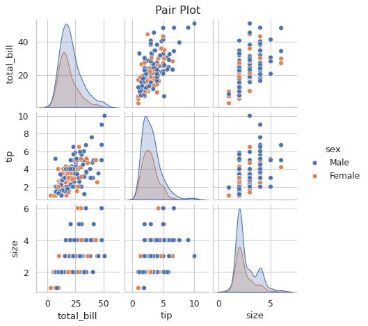

- **Diagonal**: the distribution of each variable
- **Off-diagonal**: scatter plots of each pair
- **`hue`**: colours points by a category

> ⚠️ A pair plot with 20 columns creates 400 subplots and will take a very long time. Select a handful of interesting columns first.

### Related scatter plot

```python
plt.figure(figsize=(7, 4))
sns.scatterplot(data=tips, x='total_bill', y='tip',
                hue='time', size='size', sizes=(20, 150), alpha=0.7)
plt.title('Seaborn Scatter: Tip vs Bill')
plt.tight_layout()
plt.show()
```

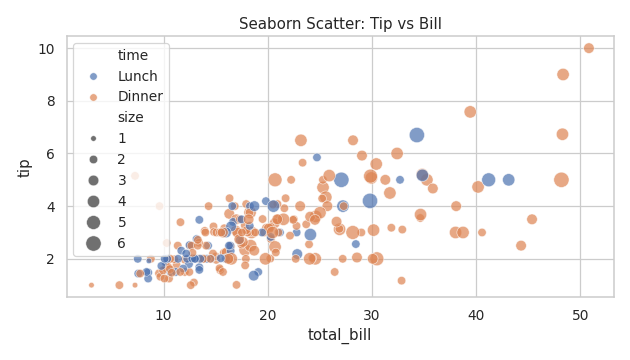

Seaborn handles the colour mapping and legend automatically — the same chart in raw Matplotlib takes many more lines.

---

## Count Plots

A **count plot** is a bar chart of category frequencies. It is `value_counts()` drawn as a picture.

```python
plt.figure(figsize=(7, 4))
sns.countplot(data=tips, x='day', hue='sex', palette='Set1')
plt.title('Count Plot: Customers by Day and Gender')
plt.tight_layout()
plt.savefig('sns_count.png', dpi=90)
plt.show()
```

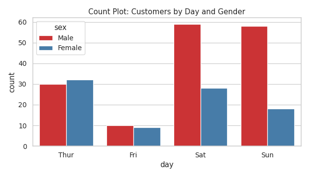

Saturday and Sunday are clearly the busiest days, and male customers outnumber female ones on every day.

### `countplot` vs `barplot`

| `countplot`               | `barplot`                            |
| ------------------------- | ------------------------------------ |
| Counts rows automatically | Shows an aggregate of a value column |
| Only needs `x`            | Needs `x` **and** `y`                |
| "How many?"               | "How much on average?"               |

```python
sns.countplot(data=tips, x='day')                    # number of customers
sns.barplot(data=tips, x='day', y='total_bill')      # average bill per day
```

`barplot()` shows the **mean** by default, with error bars for the confidence interval.

Verifying against the numbers:

```python
print(tips.groupby('day', observed=True)['total_bill'].mean().round(2))
```

Output:

```
day
Thur    17.68
Fri     17.15
Sat     20.44
Sun     21.41
Name: total_bill, dtype: float64
```

---

## Choosing the Right Chart

| Your question                 | Chart               |
| ----------------------------- | ------------------- |
| How does it change over time? | Line chart          |
| How do categories compare?    | Bar chart           |
| What is the distribution?     | Histogram / KDE     |
| Are there outliers?           | Box plot            |
| Are two variables related?    | Scatter plot        |
| How do many variables relate? | Pair plot / heatmap |
| What share of the whole?      | Pie chart (or bar)  |
| How many in each category?    | Count plot          |
| Distribution across groups?   | Box / violin plot   |

### Seaborn function reference

| Function            | Chart                            |
| ------------------- | -------------------------------- |
| `sns.lineplot()`    | Line                             |
| `sns.barplot()`     | Bar (aggregated)                 |
| `sns.countplot()`   | Bar (counts)                     |
| `sns.histplot()`    | Histogram                        |
| `sns.kdeplot()`     | Density curve                    |
| `sns.boxplot()`     | Box plot                         |
| `sns.violinplot()`  | Violin plot                      |
| `sns.scatterplot()` | Scatter                          |
| `sns.regplot()`     | Scatter + regression line        |
| `sns.heatmap()`     | Matrix of colours                |
| `sns.pairplot()`    | Grid of scatter plots            |
| `sns.jointplot()`   | Scatter + marginal distributions |
| `sns.catplot()`     | Categorical plots in facets      |

---

## Common Mistakes

### 1. `savefig()` after `show()`

```python
plt.show()
plt.savefig('chart.png')      # ❌ saves a blank image

plt.savefig('chart.png')      # ✅ save first
plt.show()
```

### 2. Forgetting to close figures in a loop

```python
for col in columns:
    plt.figure()
    plt.hist(df[col])
    plt.savefig(f'{col}.png')
    plt.close()               # ✅ prevents a memory leak
```

### 3. Overlapping labels

```python
plt.xticks(rotation=45, ha='right')
plt.tight_layout()            # ✅ fixes most layout problems
```

### 4. Truncating the y-axis on a bar chart

```python
plt.ylim(95, 100)     # ❌ makes tiny differences look enormous
plt.ylim(0, 100)      # ✅ honest
```

### 5. Too many pie slices

More than five slices becomes unreadable. Use a bar chart.

### 6. No labels

Every chart needs a title and axis labels. A chart without them is meaningless to anyone but you.

### 7. Using a rainbow colormap for continuous data

```python
plt.imshow(data, cmap='jet')       # ❌ creates false boundaries
plt.imshow(data, cmap='viridis')   # ✅ perceptually uniform
```

### 8. Ignoring colourblind readers

Roughly 8% of men have some colour vision deficiency. Use `palette='colorblind'` or vary shapes as well as colours.

---

## Quick Reference

| Task              | Code                               |
| ----------------- | ---------------------------------- |
| Import            | `import matplotlib.pyplot as plt`  |
| Import Seaborn    | `import seaborn as sns`            |
| Figure size       | `plt.figure(figsize=(10, 6))`      |
| Line              | `plt.plot(x, y)`                   |
| Bar               | `plt.bar(x, y)`                    |
| Horizontal bar    | `plt.barh(x, y)`                   |
| Pie               | `plt.pie(values, labels=)`         |
| Histogram         | `plt.hist(data, bins=30)`          |
| Scatter           | `plt.scatter(x, y)`                |
| Title             | `plt.title('...')`                 |
| Axis labels       | `plt.xlabel()`, `plt.ylabel()`     |
| Legend            | `plt.legend()`                     |
| Grid              | `plt.grid(True, alpha=0.3)`        |
| Limits            | `plt.xlim()`, `plt.ylim()`         |
| Rotate ticks      | `plt.xticks(rotation=45)`          |
| Subplots          | `fig, ax = plt.subplots(2, 2)`     |
| Fix layout        | `plt.tight_layout()`               |
| Save              | `plt.savefig('f.png', dpi=300)`    |
| Show              | `plt.show()`                       |
| Close             | `plt.close()`                      |
| Seaborn theme     | `sns.set_theme(style='whitegrid')` |
| Seaborn histogram | `sns.histplot(data, kde=True)`     |
| Box plot          | `sns.boxplot(data=df, x=, y=)`     |
| Heatmap           | `sns.heatmap(corr, annot=True)`    |
| Pair plot         | `sns.pairplot(df, hue=)`           |
| Count plot        | `sns.countplot(data=df, x=)`       |

---

## Practising This Module

Reading a chart gallery teaches you that `ax.twinx()` exists. It does not teach
you _when you need it_, and that is the part that never transfers from reading.

[**30 Chart Practice Questions**](assignments.md) shows you a rendered chart
and asks you to write the code that produces it. Tiers 1–4 cover everything on
this page. Tier 5 adds composition and annotation, and **Tier 6 rebuilds four
report charts from the starter project's cleaned data**, so the numbers you are
checking against are the same 3,000 rows you cleaned in Module 26.

Solutions live in a [separate file](assignment-solutions.md) on purpose.

> 💡 **Tip:** Start at Q1 even if it looks trivial. The Tier 1 charts take
> ninety seconds each if you genuinely know them, and if they take longer than
> that, you have learned something useful about where you actually are.
