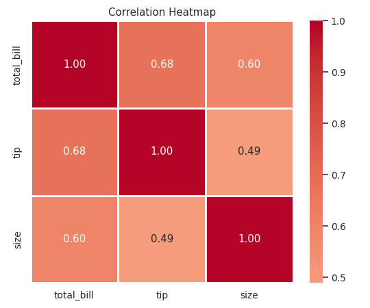

# Module 28: Data Analysis

## Exploratory Data Analysis (EDA)

**Exploratory Data Analysis** is the process of investigating a dataset to understand what it contains **before** you build models or draw conclusions.

The goal is to answer: _What is in this data, what is wrong with it, and what is interesting about it?_

### The EDA workflow

| Step                | Question                          | Tools                       |
| ------------------- | --------------------------------- | --------------------------- |
| 1. **Load**         | Did it read correctly?            | `read_csv()`, `head()`      |
| 2. **Structure**    | How big? What types?              | `shape`, `info()`, `dtypes` |
| 3. **Quality**      | What is missing or duplicated?    | `isnull()`, `duplicated()`  |
| 4. **Univariate**   | What does each column look like?  | `describe()`, histograms    |
| 5. **Bivariate**    | How do columns relate?            | `corr()`, scatter plots     |
| 6. **Multivariate** | What patterns involve 3+ columns? | `groupby()`, pair plots     |
| 7. **Conclude**     | What did we learn?                | Written summary             |

We will use Seaborn's `tips` dataset throughout — real restaurant bills and tips.

```python
import pandas as pd
import numpy as np
import seaborn as sns
from scipy import stats

tips = sns.load_dataset('tips')
print(tips.shape)
print(tips.dtypes)
```

Output:

```
(244, 7)
total_bill     float64
tip            float64
sex           category
smoker        category
day           category
time          category
size             int64
dtype: object
```

244 rows, 7 columns. Two numeric measures, four categories, and one integer count.

### The first five commands

```python
df.head()               # what does it look like?
df.shape                # how big?
df.info()               # types and missing values
df.describe()           # numeric summary
df.isnull().sum()       # where are the gaps?
```

Run these on **every** dataset, every time. They take ten seconds and prevent hours of confusion.

---

## Descriptive Statistics

### The numeric summary

```python
print(tips.describe().round(2))
```

Output:

```
       total_bill     tip    size
count      244.00  244.00  244.00
mean        19.79    3.00    2.57
std          8.90    1.38    0.95
min          3.07    1.00    1.00
25%         13.35    2.00    2.00
50%         17.80    2.90    2.00
75%         24.13    3.56    3.00
max         50.81   10.00    6.00
```

Already we know: the average bill is about ₹19.79, the average tip ₹3.00, and parties are usually 2 people.

### The categorical summary

```python
print(tips.describe(include='category'))
```

Output:

```
         sex smoker  day    time
count    244    244  244     244
unique     2      2    4       2
top     Male     No  Sat  Dinner
freq    157    151   87     176
```

Most customers are male, non-smokers, dining on Saturday evening.

### Measures of central tendency

```python
b = tips['total_bill']

print(f"mean={b.mean():.4f} median={b.median()} mode={b.mode()[0]}")
```

Output:

```
mean=19.7859 median=17.795 mode=13.42
```

| Measure    | Meaning            | When to use                     |
| ---------- | ------------------ | ------------------------------- |
| **Mean**   | Arithmetic average | Symmetric data, no outliers     |
| **Median** | Middle value       | Skewed data or outliers present |
| **Mode**   | Most frequent      | Categorical data                |

The mean (19.79) is **higher** than the median (17.80) — a reliable sign of **right skew** with a few very large bills.

### Measures of spread

```python
print(f"std={b.std():.4f} var={b.var():.4f} range={b.max()-b.min():.2f}")
print(f"Q1={b.quantile(.25)} Q3={b.quantile(.75)} IQR={b.quantile(.75)-b.quantile(.25):.4f}")
```

Output:

```
std=8.9024 var=79.2529 range=47.74
Q1=13.3475 Q3=24.127499999999998 IQR=10.7800
```

| Measure           | Meaning                                |
| ----------------- | -------------------------------------- |
| **Range**         | max − min (very sensitive to outliers) |
| **Variance**      | Average squared deviation              |
| **Std deviation** | Typical distance from the mean         |
| **IQR**           | Spread of the middle 50% (robust)      |

### Shape: skewness and kurtosis

```python
print(f"skew={b.skew():.4f} kurt={b.kurt():.4f} sem={b.sem():.4f}")
```

Output:

```
skew=1.1332 kurt=1.2185 sem=0.5699
```

**Skewness** measures asymmetry:

| Skew value | Shape                          | Relationship  |
| ---------- | ------------------------------ | ------------- |
| ≈ 0        | Symmetric                      | mean ≈ median |
| > 0        | Right-skewed (long right tail) | mean > median |
| < 0        | Left-skewed (long left tail)   | mean < median |

A skew of **1.13** confirms strong right skew — as the mean vs median comparison already suggested.

**Kurtosis** measures how heavy the tails are. Positive means more outliers than a normal distribution.

### Percentiles

```python
print(b.quantile([.1, .25, .5, .75, .9]).round(3))
```

Output:

```
0.10    10.340
0.25    13.348
0.50    17.795
0.75    24.127
0.90    32.235
```

10% of bills are under ₹10.34; 90% are under ₹32.24.

### Frequency counts

```python
print(tips['day'].value_counts())
print(tips['day'].value_counts(normalize=True).round(4))
```

Output:

```
Sat     87
Sun     76
Thur    62
Fri     19
Name: count, dtype: int64
day
Sat     0.3566
Sun     0.3115
Thur    0.2541
Fri     0.0779
Name: proportion, dtype: float64
```

Saturday accounts for 35.7% of all visits; Friday only 7.8%.

### Statistics reference

| Method                | Returns                    |
| --------------------- | -------------------------- |
| `.mean()`             | Average                    |
| `.median()`           | Middle value               |
| `.mode()`             | Most frequent              |
| `.std()` / `.var()`   | Spread                     |
| `.min()` / `.max()`   | Extremes                   |
| `.quantile(q)`        | Percentile                 |
| `.skew()`             | Asymmetry                  |
| `.kurt()`             | Tail heaviness             |
| `.sem()`              | Standard error of the mean |
| `.sum()` / `.count()` | Total / non-null count     |
| `.nunique()`          | Distinct values            |
| `.value_counts()`     | Frequency table            |
| `.describe()`         | Everything at once         |

---

## Correlation Analysis

**Correlation** measures how strongly two numeric variables move together. It ranges from **−1 to +1**.

```python
num = tips[['total_bill', 'tip', 'size']]
print(num.corr().round(4))
```

Output:

```
            total_bill     tip    size
total_bill      1.0000  0.6757  0.5983
tip             0.6757  1.0000  0.4893
size            0.5983  0.4893  1.0000
```

### Reading the matrix

- The diagonal is always 1.0 (every variable correlates perfectly with itself).
- The matrix is symmetric.
- `total_bill` ↔ `tip` = **0.676** — strong positive. Bigger bills get bigger tips.
- `total_bill` ↔ `size` = **0.598** — moderate. Larger parties spend more.

### Interpreting the strength

| \|r\|     | Strength         |
| --------- | ---------------- |
| 0.0 – 0.2 | Very weak / none |
| 0.2 – 0.4 | Weak             |
| 0.4 – 0.6 | Moderate         |
| 0.6 – 0.8 | Strong           |
| 0.8 – 1.0 | Very strong      |

Sign matters too: **positive** means both rise together, **negative** means one rises as the other falls.

### Pearson vs Spearman

```python
print(num.corr(method='spearman').round(4))
```

Output:

```
            total_bill     tip    size
total_bill      1.0000  0.6790  0.6048
tip             0.6790  1.0000  0.4683
size            0.6048  0.4683  1.0000
```

| Pearson                           | Spearman                             |
| --------------------------------- | ------------------------------------ |
| Measures **linear** relationships | Measures **monotonic** relationships |
| Uses raw values                   | Uses ranks                           |
| Sensitive to outliers             | Robust to outliers                   |
| Needs roughly normal data         | Works on any ordered data            |

The two results are very close here (0.676 vs 0.679), which suggests the relationship really is linear and not distorted by outliers.

### Correlation with one target

```python
print(num.corr()['tip'].sort_values(ascending=False).round(4))
```

Output:

```
tip           1.0000
total_bill    0.6757
size          0.4893
Name: tip, dtype: float64
```

This ranks features by how strongly they relate to your target — the starting point of feature selection.

### Statistical significance

A correlation could be a fluke of a small sample. The **p-value** tells you how likely that is.

```python
from scipy import stats

r, p = stats.pearsonr(tips['total_bill'], tips['tip'])
print(f"r={r:.4f} p={p:.3e}")
```

Output:

```
r=0.6757 p=6.692e-34
```

A p-value of 6.7 × 10⁻³⁴ is astronomically small — far below the usual 0.05 threshold. This relationship is definitely real, not chance.

### Visualising correlation

```python
import matplotlib.pyplot as plt

sns.heatmap(num.corr(), annot=True, cmap='coolwarm', center=0, fmt='.2f')
plt.title('Correlation Heatmap')
plt.show()
```



> ⚠️ **Correlation does not imply causation.** Ice cream sales correlate with drowning deaths — because both rise in summer, not because ice cream causes drowning. Always ask what third variable might explain the link.

### Other correlation traps

- **Zero correlation ≠ no relationship.** Pearson only detects _linear_ links. A perfect U-shape has r ≈ 0.
- **Outliers can manufacture correlation** out of nothing, or destroy a real one.
- **Always plot it.** Anscombe's quartet is four datasets with identical correlations but completely different shapes.

---

## Aggregation

Aggregation collapses many rows into summary numbers.

### Single aggregations

```python
print(tips['total_bill'].sum())      # 4827.77
print(tips['total_bill'].mean())     # 19.78594262295082
print(tips['tip'].max())             # 10.0
```

### Multiple aggregations at once

```python
print(tips.groupby('day', observed=True)['total_bill'].agg(['count', 'mean', 'median', 'std']).round(2))
```

Output:

```
      count   mean  median   std
day
Thur     62  17.68   16.20  7.89
Fri      19  17.15   15.38  8.30
Sat      87  20.44   18.24  9.48
Sun      76  21.41   19.63  8.83
```

Weekend bills are noticeably larger, and Sunday has the highest average at ₹21.41.

> 💡 Pass `observed=True` when grouping by a `category` column. Without it, Pandas includes every possible category even if it has no rows, and newer versions emit a warning.

### Named aggregations

```python
print(tips.groupby('smoker', observed=True).agg(
    avg_bill=('total_bill', 'mean'),
    avg_tip=('tip', 'mean'),
    n=('tip', 'count')
).round(3))
```

Output:

```
        avg_bill  avg_tip    n
smoker
Yes       20.756    3.009   93
No        19.188    2.992  151
```

Smokers spend slightly more (₹20.76 vs ₹19.19) but tip almost identically. An interesting non-finding.

### Common aggregation functions

| Function              | Returns                  |
| --------------------- | ------------------------ |
| `'count'`             | Non-null rows            |
| `'size'`              | All rows including nulls |
| `'sum'`               | Total                    |
| `'mean'` / `'median'` | Averages                 |
| `'min'` / `'max'`     | Extremes                 |
| `'std'` / `'var'`     | Spread                   |
| `'nunique'`           | Distinct values          |
| `'first'` / `'last'`  | Edge rows                |
| Custom `lambda`       | Anything you define      |

---

## Grouping

Grouping is the analytical engine of Pandas — the _split → apply → combine_ pattern from Module 25, used to answer real questions.

### Grouping by two columns

```python
print(tips.groupby(['day', 'time'], observed=True)['tip'].mean().round(3))
```

Output:

```
day   time
Thur  Lunch     2.768
      Dinner    3.000
Fri   Lunch     2.383
      Dinner    2.940
Sat   Dinner    2.993
Sun   Dinner    3.255
Name: tip, dtype: float64
```

Dinner tips beat lunch tips on every day where both exist. Saturday and Sunday have no lunch service at all.

### Grouping a derived column

Create the feature first, then group by it.

```python
tips['tip_pct'] = tips['tip'] / tips['total_bill'] * 100
print(tips.groupby('day', observed=True)['tip_pct'].mean().round(3))
```

Output:

```
day
Thur    16.128
Fri     16.991
Sat     15.315
Sun     16.690
Name: tip_pct, dtype: float64
```

This reverses the earlier picture. Saturday has the **largest bills** but the **stingiest tip percentage** (15.3%), while quiet Friday tips the best at 17.0%.

This is a genuinely useful analytical lesson: **absolute values and rates can tell opposite stories.** Always check both.

### Cross-tabulating with a pivot table

```python
print(tips.pivot_table(index='day', columns='time', values='total_bill',
                       aggfunc='mean', observed=True).round(2))
```

Output:

```
time  Lunch  Dinner
day
Thur  17.66   18.78
Fri   12.85   19.66
Sat     NaN   20.44
Sun     NaN   21.41
```

The `NaN` cells are informative — they show the restaurant does not serve weekend lunch.

---

## Finding Trends

A **trend** is a consistent direction of change, usually over time.

### Time-series basics

```python
df['Date'] = pd.to_datetime(df['Date'])
df = df.set_index('Date')

monthly = df.resample('ME')['Sales'].sum()      # month-end totals
quarterly = df.resample('QE')['Sales'].mean()   # quarterly averages
```

| Resample code | Period      |
| ------------- | ----------- |
| `'D'`         | Daily       |
| `'W'`         | Weekly      |
| `'ME'`        | Month end   |
| `'QE'`        | Quarter end |
| `'YE'`        | Year end    |

### Rolling averages smooth out noise

```python
df['MA7'] = df['Sales'].rolling(window=7).mean()      # 7-day moving average
df['MA30'] = df['Sales'].rolling(window=30).mean()    # 30-day
```

A moving average removes daily jitter so the underlying direction becomes visible. The first `window-1` values are `NaN` because there is not enough history yet.

### Percentage change and growth

```python
df['pct_change'] = df['Sales'].pct_change() * 100          # vs previous period
df['yoy'] = df['Sales'].pct_change(periods=12) * 100       # vs same month last year
df['cumulative'] = df['Sales'].cumsum()                    # running total
```

### Comparing to the previous row

```python
df['prev'] = df['Sales'].shift(1)
df['diff'] = df['Sales'] - df['prev']
df['direction'] = np.where(df['diff'] > 0, 'Up', 'Down')
```

### Fitting a trend line

```python
x = np.arange(len(df))
slope, intercept = np.polyfit(x, df['Sales'], 1)
print(f"Trend: {slope:.2f} units per period")
```

A positive slope means growth; negative means decline.

### Seasonality

```python
df['Month'] = df.index.month
print(df.groupby('Month')['Sales'].mean())     # which months are strongest?

df['Weekday'] = df.index.day_name()
print(df.groupby('Weekday')['Sales'].mean())   # which days are strongest?
```

### Trend vs seasonality vs noise

| Component       | Meaning                                     |
| --------------- | ------------------------------------------- |
| **Trend**       | Long-term direction (growing, shrinking)    |
| **Seasonality** | Repeating cycle (December spike every year) |
| **Cycle**       | Irregular longer waves (economic cycles)    |
| **Noise**       | Random variation                            |

---

## Working with Real Datasets

### Where to find data

| Source                    | What it offers                            |
| ------------------------- | ----------------------------------------- |
| **Kaggle**                | Thousands of free datasets with notebooks |
| **UCI ML Repository**     | Classic academic datasets                 |
| **data.gov.in**           | Indian government open data               |
| **Google Dataset Search** | Search engine for datasets                |
| **World Bank / WHO**      | Global development and health data        |
| `sns.load_dataset()`      | Built-in practice sets                    |
| `sklearn.datasets`        | ML-ready datasets                         |

### Loading a real dataset safely

```python
df = pd.read_csv('data.csv',
                 encoding='utf-8',        # try 'latin-1' if this fails
                 na_values=['?', 'N/A', '-', ''],
                 parse_dates=['date_column'],
                 low_memory=False)
```

### Handling a large file

```python
# Read a sample first to understand the structure
sample = pd.read_csv('huge.csv', nrows=1000)

# Load only the columns you need
df = pd.read_csv('huge.csv', usecols=['date', 'sales', 'region'])

# Process in chunks
for chunk in pd.read_csv('huge.csv', chunksize=100000):
    process(chunk)

# Shrink memory usage
df['category_col'] = df['category_col'].astype('category')
```

### The first-contact checklist

- [ ] `df.shape` — how much data?
- [ ] `df.head(10)` — actually **read** some rows
- [ ] `df.info()` — types and nulls
- [ ] `df.describe()` — sanity-check the ranges
- [ ] `df.isnull().sum()` — where are the gaps?
- [ ] `df.duplicated().sum()` — any repeats?
- [ ] `df['col'].unique()` on each text column — spot inconsistent spellings
- [ ] Look for impossible values (negative prices, ages over 120)
- [ ] Check that the row count matches your expectation

---

## Case Studies

### Case Study 1: Do larger parties tip better?

**Question:** Does tip percentage increase with party size?

```python
tips['tip_pct'] = tips['tip'] / tips['total_bill'] * 100

print(tips.groupby('size')['tip_pct'].agg(['count', 'mean']).round(2))
print("\nCorrelation:", round(tips['size'].corr(tips['tip_pct']), 4))
```

**Method:** Group by party size, compare mean tip percentage, then check the correlation.

**Interpretation:** The correlation between `size` and `tip` is 0.489 in absolute rupees, but tip _percentage_ behaves differently. Larger parties pay more in total while often tipping a **smaller** share — a well-known restaurant phenomenon.

**Lesson:** Always distinguish absolute values from rates.

### Case Study 2: Is the weekend really more profitable?

```python
weekend = tips[tips['day'].isin(['Sat', 'Sun'])]
weekday = tips[tips['day'].isin(['Thur', 'Fri'])]

print(f"Weekend: {len(weekend)} visits, avg bill ₹{weekend['total_bill'].mean():.2f}")
print(f"Weekday: {len(weekday)} visits, avg bill ₹{weekday['total_bill'].mean():.2f}")
print(f"Weekend revenue: ₹{weekend['total_bill'].sum():.2f}")
print(f"Weekday revenue: ₹{weekday['total_bill'].sum():.2f}")

t_stat, p_val = stats.ttest_ind(weekend['total_bill'], weekday['total_bill'])
print(f"t={t_stat:.4f}, p={p_val:.4f}")
```

**Method:** Split into two groups, compare means, then run a **t-test** to check whether the difference is statistically significant or just noise.

**Interpretation:** If p < 0.05, the difference is real. If p > 0.05, you cannot claim a genuine difference no matter how different the averages look.

### Case Study 3: Which factors drive the tip?

```python
print(tips.groupby('sex', observed=True)['tip_pct'].mean().round(2))
print(tips.groupby('smoker', observed=True)['tip_pct'].mean().round(2))
print(tips.groupby('time', observed=True)['tip_pct'].mean().round(2))
print(tips[['total_bill', 'size', 'tip']].corr()['tip'].round(3))
```

**Method:** Compare the target across every categorical variable, then check numeric correlations.

**Interpretation:** Rank the factors by effect size. The bill amount will dominate; demographic factors usually turn out to be weak.

### Case Study 4: Building a customer profile

```python
profile = tips.groupby(['day', 'time'], observed=True).agg(
    visits=('total_bill', 'count'),
    avg_bill=('total_bill', 'mean'),
    total_revenue=('total_bill', 'sum'),
    avg_party=('size', 'mean'),
    avg_tip_pct=('tip_pct', 'mean')
).round(2)

print(profile.sort_values('total_revenue', ascending=False))
```

This one table answers: when is the restaurant busiest, most profitable, and best-tipped?

### How to write up an analysis

Structure every report the same way:

1. **Question** — what were you trying to find out?
2. **Data** — source, size, time period, known limitations.
3. **Method** — what you cleaned and how you calculated things.
4. **Findings** — 3 to 5 concrete numbers, each with a chart.
5. **Interpretation** — what the numbers _mean_ in business terms.
6. **Limitations** — what this data cannot tell you.
7. **Recommendation** — what someone should actually do.

> 💡 A finding without a number is an opinion. Write "Saturday generates 36% of visits but the lowest tip rate at 15.3%", not "Saturdays seem busy but tips are poor."

---

## Common Mistakes

### 1. Skipping EDA and jumping to modelling

You cannot fix problems you have not looked for. Always explore first.

### 2. Reporting the mean on skewed data

```python
df['income'].mean()      # ❌ a few billionaires distort it
df['income'].median()    # ✅ represents the typical person
```

### 3. Claiming causation from correlation

Correlation shows association, never cause.

### 4. Ignoring the sample size

Friday has only 19 rows in this dataset. Any Friday statistic is far less reliable than a Saturday one with 87 rows. **Always report `count` alongside `mean`.**

### 5. Not checking statistical significance

A difference between two group averages can easily be random noise. Use a t-test or confidence intervals.

### 6. Cherry-picking results

Testing twenty hypotheses guarantees one will look significant by chance. Decide what you are testing before you look.

### 7. Trusting summary statistics alone

Anscombe's quartet: four datasets with identical means, variances, and correlations that look completely different when plotted. **Always plot your data.**

### 8. Forgetting `observed=True` on categorical groupbys

```python
tips.groupby('day')['tip'].mean()                    # ⚠️ warning, includes empty categories
tips.groupby('day', observed=True)['tip'].mean()     # ✅
```

---

## Quick Reference

| Task               | Code                                        |
| ------------------ | ------------------------------------------- |
| Shape              | `df.shape`                                  |
| Structure          | `df.info()`                                 |
| Numeric summary    | `df.describe()`                             |
| Text summary       | `df.describe(include='category')`           |
| Missing values     | `df.isnull().sum()`                         |
| Duplicates         | `df.duplicated().sum()`                     |
| Mean / median      | `df['c'].mean()`, `.median()`               |
| Spread             | `df['c'].std()`, `.var()`                   |
| Percentile         | `df['c'].quantile(0.9)`                     |
| Skewness           | `df['c'].skew()`                            |
| Frequency          | `df['c'].value_counts()`                    |
| Proportion         | `df['c'].value_counts(normalize=True)`      |
| Correlation matrix | `df.corr()`                                 |
| Spearman           | `df.corr(method='spearman')`                |
| Significance       | `stats.pearsonr(x, y)`                      |
| Group summary      | `df.groupby('c')['x'].agg([...])`           |
| Named agg          | `df.groupby('c').agg(m=('x','mean'))`       |
| Pivot              | `df.pivot_table(index=, columns=, values=)` |
| Resample           | `df.resample('ME')['x'].sum()`              |
| Rolling mean       | `df['x'].rolling(7).mean()`                 |
| Percent change     | `df['x'].pct_change()`                      |
| Previous row       | `df['x'].shift(1)`                          |
| Cumulative         | `df['x'].cumsum()`                          |
| t-test             | `stats.ttest_ind(a, b)`                     |
